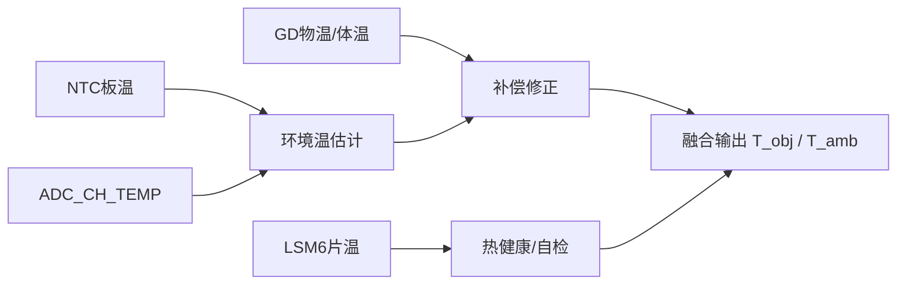

<!-- Generated by SpecStory, Markdown v2.1.0 -->

# 2026-08-20 03:09:44Z

<!-- Codex CLI Session 01a01d25-6406-7c80-bf90-111b3e189974 (2026-08-20 03:09:44Z) -->

_**User (2026-08-20 03:09:44Z)**_

[Image]
<image_files>
The following images were provided by the user and saved to the workspace for future use:
1. C:\Users\BAI26\.cursor\projects\c-Users-BAI26-Desktop-2026-07/assets/c__Users_BAI26_AppData_Roaming_Cursor_User_workspaceStorage_b0094a74a4e915e5c42cbbd19ec01537_images_image-170cedd7-1db7-405b-b852-f4361b6689be.png

These images can be copied for use in other locations.
</image_files>
<timestamp>Monday, Aug 3, 2026, 8:49 AM (UTC+8)</timestamp>
<user_query>

</user_query>

---

_**Agent (2026-08-20 03:09:44Z)**_

I'll read the screenshot and draft the empty weekly-report sections from the completed work.

[external_agent_tool_call: Read]
input: {"path":"C:\\Users\\BAI26\\.cursor\\projects\\c-Users-BAI26-Desktop-2026-07\\assets\\c__Users_BAI26_AppData_Roaming_Cursor_User_workspaceStorage_b0094a74a4e915e5c42cbbd19ec01537_images_image-170cedd7-1db7-405b-b852-f4361b6689be.png"}
[/external_agent_tool_call]

[external_agent_tool_call: Glob]
input: {"glob_pattern":"**/*","target_directory":"c:\\Users\\BAI26\\Desktop\\2026-07"}
[/external_agent_tool_call]

_**Agent (2026-08-20 03:09:44Z)**_

按你已填的完成项，下面几栏可直接粘贴：

---

**本周已计划但未完成：**
无。蓝牙与传感器相关代码已完成编写/封装，实际联调与实测受样板到位进度影响，顺延至下周。

---

**本周总结：**
非视觉计算模组基础环境（TFLM、DSP、RTOS）已就绪；本周完成经典蓝牙/BLE SDK 编写、六轴与温度传感器驱动初稿及 SDK 封装，并完成原理图修改与 PCB 打样。软件侧具备联调条件，硬件与传感器实测待样板回来后开展。

---

**下周工作计划：**
1. 经典蓝牙、低功耗蓝牙 SDK 实机测试与问题修复  
2. 六轴、温度传感器驱动联调与数据采集验证  
3. 传感器 SDK 接口联调与稳定性优化  
4. 跟进 PCB 打样进度，到板后开展基础功能与接口验证  

---

**其它：是否需要协助：**
暂无额外协助需求。若 PCB 交期或物料有异常，再同步协调。

---

如需改成更短/更正式，或「未完成」要写成具体事项（例如把「待测试」算作未完成），说一下我帮你改一版。

---

_**User (2026-08-20 03:09:44Z)**_

下周测试板还没做好，应该写融合算法之类的

---

_**Agent (2026-08-20 03:09:44Z)**_

按「下周测试板未到位」调整一版，计划侧重融合算法：

---

**本周已计划但未完成：**  
无。

---

**本周总结：**  
非视觉计算模组基础环境（TFLM、DSP、RTOS）已就绪；本周完成经典蓝牙/BLE SDK 编写、六轴与温度传感器驱动初稿及 SDK 封装，并完成原理图修改与 PCB 打样。软件侧具备联调条件，因测试板尚未完成，实机验证顺延，下周先行推进传感器融合算法相关开发。

---

**下周工作计划：**  
1. 六轴（加速度计/陀螺仪）数据预处理与标定流程设计  
2. 姿态融合算法开发与仿真/离线验证（如互补滤波 / AHRS / EKF）  
3. 温度补偿与融合输出接口封装  
4. 完善蓝牙/传感器 SDK 接口与单元自测（不依赖测试板）  

---

**其它：是否需要协助：**  
暂无。测试板完成后，再安排实机联调与算法效果验证。

---

若你们已定用某一种融合方案（例如只写 AHRS/EKF），可以说一下，我帮你把第 2 条写得更具体。

---

_**User (2026-08-20 03:09:44Z)**_

看一下当前的这个非视觉感知模组的文件夹和工程，掌握一下现在的工程

---

_**Agent (2026-08-20 03:09:44Z)**_

先梳理工程目录与关键模块，摸清非视觉感知模组的现状。

[external_agent_tool_call: Task]
description: Explore non-visual module
[/external_agent_tool_call]

_**Agent (2026-08-20 03:09:44Z)**_

核对几个关键点，确保工程现状判断准确。

[external_agent_tool_call: Read]
input: {"path":"c:\\Users\\BAI26\\Desktop\\2026-07\\HT67595固件方案\\HT67595固件方案\\Prj1V0\\sources\\components\\ht32f675x5_r2\\ahrs\\README.md","limit":80}
[/external_agent_tool_call]

[external_agent_tool_call: Read]
input: {"path":"c:\\Users\\BAI26\\Desktop\\2026-07\\HT67595固件方案\\HT67595固件方案\\Prj1V0\\projects\\ble_examples\\app\\ht32f675x5_r2\\config\\app_cfg.h","limit":120}
[/external_agent_tool_call]

[external_agent_tool_call: Glob]
input: {"glob_pattern":"**/ht32f675x5_r2/**/*","target_directory":"c:\\Users\\BAI26\\Desktop\\2026-07\\HT67595固件方案\\HT67595固件方案\\Prj1V0\\sources\\components"}
[/external_agent_tool_call]

[external_agent_tool_call: Shell]
description: List root and component dirs, madgwick size
command: Get-ChildItem "c:\Users\BAI26\Desktop\2026-07" -Name; Write-Host "---"; Get-Item "c:\Users\BAI26\Desktop\2026-07\HT67595固件方案\HT67595固件方案\Prj1V0\sources\components\ht32f675x5_r2\ahrs\ahrs_madgwick.c" | Select-Object Name, Length; Get-ChildItem "c:\Users\BAI26\Desktop\2026-07\HT67595固件方案\HT67595固件方案\Prj1V0\sources\components\ht32f675x5_r2" -Name
[/external_agent_tool_call]

_**Agent (2026-08-20 03:09:44Z)**_

[external_agent_tool_call: Grep]
input: {"path":"c:\\Users\\BAI26\\Desktop\\2026-07\\HT67595固件方案\\HT67595固件方案\\Prj1V0\\projects\\ble_examples\\app\\ht32f675x5_r2\\config\\app_cfg.h","pattern":"SENSOR_|IMU|AHRS|TFLM|GD60932|BLE_SENSOR|ENABLED"}
[/external_agent_tool_call]

[external_agent_tool_call: Shell]
description: List dirs and madgwick file size via cmd
command: cmd /c "dir /b \"c:\Users\BAI26\Desktop\2026-07\" & echo --- & dir \"c:\Users\BAI26\Desktop\2026-07\HT67595固件方案\HT67595固件方案\Prj1V0\sources\components\ht32f675x5_r2\ahrs\ahrs_madgwick.c\" & echo --- & dir /b \"c:\Users\BAI26\Desktop\2026-07\HT67595固件方案\HT67595固件方案\Prj1V0\sources\components\ht32f675x5_r2\""
[/external_agent_tool_call]

[external_agent_tool_call: Grep]
input: {"path":"c:\\Users\\BAI26\\Desktop\\2026-07\\HT67595固件方案\\HT67595固件方案\\Prj1V0\\sources\\projects_source\\ble_examples\\ble_peripheral\\ht32f675x5_r2\\main\\mp\\main.c","pattern":"imu9dof|ahrs_|gd60932|ble_sensor|tflm|SENSOR_SDK"}
[/external_agent_tool_call]

_**Agent (2026-08-20 03:09:44Z)**_

[external_agent_tool_call: Read]
input: {"path":"c:\\Users\\BAI26\\Desktop\\2026-07\\HT67595固件方案\\HT67595固件方案\\Prj1V0\\sources\\components\\ht32f675x5_r2\\ahrs\\ahrs_madgwick.c","limit":20}
[/external_agent_tool_call]

[external_agent_tool_call: Read]
input: {"path":"c:\\Users\\BAI26\\Desktop\\2026-07\\HT67595固件方案\\HT67595固件方案\\Prj1V0\\sources\\projects_source\\ble_examples\\ble_peripheral\\ht32f675x5_r2\\main\\mp\\main.c","offset":300,"limit":50}
[/external_agent_tool_call]

[external_agent_tool_call: Read]
input: {"path":"c:\\Users\\BAI26\\Desktop\\2026-07\\HT67595固件方案\\HT67595固件方案\\Prj1V0\\sources\\components\\ht32f675x5_r2\\imu9dof\\README.md","limit":60}
[/external_agent_tool_call]

_**Agent (2026-08-20 03:09:44Z)**_

工作区里没有单独叫「非视觉感知」的顶层目录，能力主要落在 **HT32F67595 固件 `Prj1V0`** 上。

## 目录角色

| 路径 | 作用 |
|------|------|
| `HT67595固件方案/.../Prj1V0` | **主工程**（传感器 / AHRS / BLE / TFLM） |
| `HT67595固件方案/.../Test1V0` | 官方 FWLib 对照包 |
| `感知模组开发资料` | Holtek **CGM 血糖参考板**资料（另一条线） |
| `芯力微` | 电源芯片规格书 |

日常开发打开：

`Prj1V0\projects\ble_examples\app\ht32f675x5_r2\project\ble_peripheral.uvmpw`

## 架构

- **MP（Cortex-M33）**：应用核 — 传感、AHRS、可选 TFLM  
- **CP（Cortex-M0+）**：BLE 协议栈 + GATT  
- 板级引脚：`ht32f67595_user.h`（自定义 LGA28）

主循环骨架（`main.c`）：`imu9dof_read` → `ahrs_update` → `gd60932_measure` → `ble_sensor_ipc_send_sample`

## 业务组件现状

路径：`Prj1V0\sources\components\ht32f675x5_r2\`

| 模块 | 器件/能力 | 状态 |
|------|-----------|------|
| `bsp_spi` + `lsm6dsow` | 六轴 SPI | 驱动较完整 |
| `ist8310` + `imu9dof` | 磁力计（经 LSM6 Sensor Hub）+ 九轴 facade | 代码齐，待实板 |
| `ahrs` | Madgwick（默认）/ EKF | **EKF 有实现；`ahrs_madgwick.c` 为空文件**，但 `main.c` 默认用 Madgwick |
| `gd60932` + `bsp_uart_irt` | 红外温度（UART1） | SDK 齐；与 debug UART 共用脚 |
| `ble_sensor` | 私有 GATT `0xFEA0` + MP→CP IPC | 代码已挂工程，端到端待验 |
| `tflm_app` | Hello sine 推理 | 源树有；主 `app` 工程未开测试宏，另一工程曾链接失败 |

`app_cfg.h` 当前开关：`IMU9DOF` / `GD60932` / `SENSOR_SDK_TEST` / `BLE_SENSOR_SDK` 均为 **1**。

## 阶段判断

已形成：**采数 → AHRS → UART 打印 / BLE 上报** 的软件骨架。  
驱动与 SDK 大多写完；**Madgwick 空实现、实板联调未做、TFLM 未闭环**。测试板未到位时，最自然的推进点就是补全/打磨融合算法（Madgwick 或改默认 EKF），并用离线/仿真数据验证。

需要的话我可以下一步按模块把 `ahrs` / `imu9dof` / `ble_sensor` 的接口和调用链再拆细，或直接帮你定下周融合算法的具体改动清单。

---

_**User (2026-08-20 03:09:44Z)**_

目前各个驱动文件在什么地方

---

_**Agent (2026-08-20 03:09:44Z)**_

[external_agent_tool_call: Shell]
description: List driver component dirs and files
command: Get-ChildItem -Path "c:\Users\BAI26\Desktop\2026-07\HT67595固件方案\HT67595固件方案\Prj1V0\sources\components\ht32f675x5_r2" -Directory | ForEach-Object { $name = $_.Name; $files = Get-ChildItem $_.FullName -File -Recurse | Where-Object { $_.Extension -match '\.(c|h|cpp|cc|md)$' } | ForEach-Object { $_.Name }; [PSCustomObject]@{ Dir = $name; Files = ($files -join ', ') } } | Format-Table -AutoSize -Wrap
[/external_agent_tool_call]

_**Agent (2026-08-20 03:09:44Z)**_

业务相关驱动都在这一层：

`HT67595固件方案\HT67595固件方案\Prj1V0\sources\components\ht32f675x5_r2\`

## 传感器 / 通信驱动（自研业务）

| 层级 | 目录 | 文件 |
|------|------|------|
| SPI 平台 | `bsp_spi\` | `bsp_spi.c` / `.h` |
| 六轴 | `lsm6dsow\` | `lsm6dsow.c` / `.h` / `lsm6dsow_regs.h` |
| 磁力计 | `ist8310\` | `ist8310.c` / `.h` / `ist8310_regs.h` |
| 九轴封装 | `imu9dof\` | `imu9dof.c` / `.h` |
| 红外 UART 平台 | `bsp_uart_irt\` | `bsp_uart_irt.c` / `.h` |
| 红外温度 | `gd60932\` | `gd60932.c` / `.h` |
| 姿态融合 | `ahrs\` | `ahrs.c` / `.h`、`ahrs_ekf.c`、`ahrs_madgwick.c`（空）、`ahrs_internal.h` |
| BLE 传感上报 | `ble_sensor\` | `ble_sensor*.c/h` |
| TFLM | `tflm_app\` | `tflm_infer.cpp`、`hello_world_model_data.*` |

## 板级引脚

`Prj1V0\sources\boards\ht32f67595_user.h`  
（SPI / UART / DRDY 等引脚定义）

## 调用入口

`Prj1V0\sources\projects_source\ble_examples\ble_peripheral\ht32f675x5_r2\main\mp\main.c`

## 依赖关系（简图）

```
bsp_spi → lsm6dsow → ist8310(hub) → imu9dof → ahrs
bsp_uart_irt → gd60932
imu9dof + gd60932 + ahrs → ble_sensor → CP BLE
```

同目录下还有 `lpwr_ctrl`、`ota`、`ipc_*`、`mlog` 等原厂 SDK 组件，不是外设驱动本体。

---

_**User (2026-08-20 03:09:44Z)**_

adc的ntc有没有写驱动

---

_**Agent (2026-08-20 03:09:44Z)**_

[external_agent_tool_call: Grep]
input: {"path":"c:\\Users\\BAI26\\Desktop\\2026-07\\HT67595固件方案\\HT67595固件方案\\Prj1V0","pattern":"ntc|NTC|adc|ADC","glob":"*.{c,h}","-i":true}
[/external_agent_tool_call]

[external_agent_tool_call: Glob]
input: {"glob_pattern":"**/*adc*","target_directory":"c:\\Users\\BAI26\\Desktop\\2026-07\\HT67595固件方案\\HT67595固件方案\\Prj1V0"}
[/external_agent_tool_call]

[external_agent_tool_call: Glob]
input: {"glob_pattern":"**/*ntc*","target_directory":"c:\\Users\\BAI26\\Desktop\\2026-07\\HT67595固件方案\\HT67595固件方案\\Prj1V0"}
[/external_agent_tool_call]

_**Agent (2026-08-20 03:09:44Z)**_

**没有独立的 NTC 驱动模块**（`components` 下没有 `ntc/` 之类目录）。

目前只有 `main.c` 里的测试代码在采 ADC 电压：

- 位置：`...\main\mp\main.c` 中的 `sensor_test_adc_init()` / `sensor_test_adc_read()`
- 引脚：`ht32f67595_user.h` — `P21=NTC_ADC`，`P24=NTC_GND`（采样时拉低）
- 底层：原厂 `patch_hal_adc` / `hal_adc`（不是自研 NTC 驱动）
- 输出：只读 **mV**（`u16Ntc_mV`），经 BLE `ENV` 包上报；**没有**阻值换算、查表或摄氏度接口

结论：ADC 采 NTC 通道的代码有，完整 NTC 温度驱动还没有。

---

_**User (2026-08-20 03:09:44Z)**_

请先编写这个驱动

---

_**Agent (2026-08-20 03:09:44Z)**_

先对照现有 ADC 采样代码和同类驱动风格，再补一套独立的 NTC 驱动。

[external_agent_tool_call: Read]
input: {"path":"c:\\Users\\BAI26\\Desktop\\2026-07\\HT67595固件方案\\HT67595固件方案\\Prj1V0\\sources\\projects_source\\ble_examples\\ble_peripheral\\ht32f675x5_r2\\main\\mp\\main.c","offset":200,"limit":100}
[/external_agent_tool_call]

[external_agent_tool_call: Read]
input: {"path":"c:\\Users\\BAI26\\Desktop\\2026-07\\HT67595固件方案\\HT67595固件方案\\Prj1V0\\sources\\components\\ht32f675x5_r2\\gd60932\\gd60932.h","limit":100}
[/external_agent_tool_call]

[external_agent_tool_call: Read]
input: {"path":"c:\\Users\\BAI26\\Desktop\\2026-07\\HT67595固件方案\\HT67595固件方案\\Prj1V0\\sources\\boards\\ht32f67595_user.h","limit":100}
[/external_agent_tool_call]

[external_agent_tool_call: Grep]
input: {"path":"c:\\Users\\BAI26\\Desktop\\2026-07\\HT67595固件方案\\HT67595固件方案\\Prj1V0\\projects\\ble_examples\\app\\ht32f675x5_r2","pattern":"gd60932|imu9dof|bsp_spi|imu_sdk|IncludePath|FileName","glob":"*.uvprojx"}
[/external_agent_tool_call]

[external_agent_tool_call: Grep]
input: {"path":"c:\\Users\\BAI26\\Desktop\\2026-07","pattern":"NTC|ntc|10K|3950|B25","glob":"*.{md,h,c,txt,pdf}","head_limit":40}
[/external_agent_tool_call]

_**Agent (2026-08-20 03:09:44Z)**_

[external_agent_tool_call: Read]
input: {"path":"c:\\Users\\BAI26\\Desktop\\2026-07\\HT67595固件方案\\HT67595固件方案\\Prj1V0\\sources\\components\\ht32f675x5_r2\\bsp_spi\\bsp_spi.c","limit":80}
[/external_agent_tool_call]

[external_agent_tool_call: Read]
input: {"path":"c:\\Users\\BAI26\\Desktop\\2026-07\\HT67595固件方案\\HT67595固件方案\\Prj1V0\\sources\\patch\\ht32f675x5_patch_lib_r2\\patch_hal\\inc\\patch_hal_adc.h","limit":80}
[/external_agent_tool_call]

[external_agent_tool_call: Read]
input: {"path":"c:\\Users\\BAI26\\Desktop\\2026-07\\HT67595固件方案\\HT67595固件方案\\Prj1V0\\sources\\projects_source\\ble_examples\\ble_peripheral\\ht32f675x5_r2\\main\\mp\\main.c","limit":80}
[/external_agent_tool_call]

[external_agent_tool_call: Read]
input: {"path":"c:\\Users\\BAI26\\Desktop\\2026-07\\HT67595固件方案\\HT67595固件方案\\Prj1V0\\projects\\ble_examples\\app\\ht32f675x5_r2\\project\\mp\\ble_peripheral_mp.uvprojx","offset":340,"limit":180}
[/external_agent_tool_call]

_**Agent (2026-08-20 03:09:44Z)**_

[external_agent_tool_call: Grep]
input: {"path":"c:\\Users\\BAI26\\Desktop\\2026-07\\HT67595固件方案\\HT67595固件方案\\Prj1V0\\sources\\components\\ht32f675x5_r2","pattern":"#include <math.h>|logf|sinf","glob":"*.{c,cpp}"}
[/external_agent_tool_call]

[external_agent_tool_call: Read]
input: {"path":"c:\\Users\\BAI26\\Desktop\\2026-07\\HT67595固件方案\\HT67595固件方案\\Prj1V0\\sources\\projects_source\\ble_examples\\ble_peripheral\\ht32f675x5_r2\\main\\mp\\main.c","offset":340,"limit":80}
[/external_agent_tool_call]

[external_agent_tool_call: Read]
input: {"path":"c:\\Users\\BAI26\\Desktop\\2026-07\\HT67595固件方案\\HT67595固件方案\\Prj1V0\\sources\\components\\ht32f675x5_r2\\utility\\err_def.h","limit":40}
[/external_agent_tool_call]

[external_agent_tool_call: Grep]
input: {"path":"c:\\Users\\BAI26\\Desktop\\2026-07\\HT67595固件方案\\HT67595固件方案\\Prj1V0\\sources\\drivers\\ht32f675x5_r2\\ht32\\hal\\inc\\hal_adc.h","pattern":"ADC_CH_1|ADC_CH_2|EN_ADC_CH"}
[/external_agent_tool_call]

_**Agent (2026-08-20 03:09:44Z)**_

[external_agent_tool_call: Grep]
input: {"path":"c:\\Users\\BAI26\\Desktop\\2026-07\\HT67595固件方案\\HT67595固件方案\\Prj1V0\\sources\\drivers\\ht32f675x5_r2\\ht32\\hw\\inc\\hw_adc.h","pattern":"ADC_CH_","head_limit":40}
[/external_agent_tool_call]

[external_agent_tool_call: TodoWrite]
input: {"todos":[{"id":"1","content":"Create ntc.h / ntc.c driver","status":"in_progress"},{"id":"2","content":"Wire into main.c + Keil uvprojx include/sources","status":"pending"}],"merge":false}
[/external_agent_tool_call]

_**Agent (2026-08-20 03:09:44Z)**_

正在编写独立 NTC 驱动，并把 `main.c` 里的内联 ADC 采样替换掉。

[external_agent_tool_call: Write]
input: {"path":"c:\\Users\\BAI26\\Desktop\\2026-07\\HT67595固件方案\\HT67595固件方案\\Prj1V0\\sources\\components\\ht32f675x5_r2\\ntc\\ntc.h","contents":"/*************************************************************************************************************\n * @file    ntc.h\n * @brief   Board NTC + BAT ADC sense SDK (P21 NTC_ADC, P24 NTC_GND, P09 BAT_ADC).\n *\n * Assumed divider: Vref -- Rpull -- NTC_ADC -- NTC -- NTC_GND(switched).\n * Temperature uses B-parameter equation; Rpull/R25/Beta are board-configurable.\n ************************************************************************************************************/\n#ifndef __NTC_H__\n#define __NTC_H__\n\n#include <stdint.h>\n#include <stdbool.h>\n#include \"err_def.h\"\n\n#ifdef __cplusplus\nextern \"C\" {\n#endif\n\ntypedef struct\n{\n    uint16_t u16Vref_mV;     /* ADC / divider top voltage, default 3300 */\n    uint32_t u32Rpull_ohm;   /* series pull-up, default 10000 */\n    uint32_t u32R25_ohm;     /* NTC resistance @ 25 C, default 10000 */\n    float    fBeta;          /* B25/50 or B25/85, default 3950 */\n    bool     bKeepBiasOn;    /* true: leave NTC_GND low after sample */\n    bool     bEnableBatCh;   /* true: also init BAT ADC channel */\n} ntc_cfg_t;\n\ntypedef struct\n{\n    uint16_t u16Adc_mV;\n    uint32_t u32R_ohm;\n    float    fTemp_C;\n    bool     bValid;\n} ntc_sample_t;\n\nvoid ntc_cfg_default(ntc_cfg_t *pstCfg);\n\nEN_ERR_STA_T ntc_init(const ntc_cfg_t *pstCfg);\nEN_ERR_STA_T ntc_deinit(void);\n\nEN_ERR_STA_T ntc_set_cfg(const ntc_cfg_t *pstCfg);\nEN_ERR_STA_T ntc_get_cfg(ntc_cfg_t *pstCfg);\n\nEN_ERR_STA_T ntc_bias_enable(bool bEnable);\n\n/* Raw ADC voltage on NTC_ADC (mV). Enables bias for the sample. */\nEN_ERR_STA_T ntc_read_mv(uint16_t *pu16Ntc_mV);\n\n/* Resistance / temperature helpers (need valid Rpull/Vref/R25/Beta). */\nEN_ERR_STA_T ntc_mv_to_ohm(uint16_t u16Ntc_mV, uint32_t *pu32R_ohm);\nEN_ERR_STA_T ntc_ohm_to_c(uint32_t u32R_ohm, float *pfTemp_C);\nEN_ERR_STA_T ntc_read_o...
[/external_agent_tool_call]

[external_agent_tool_call: Write]
input: {"path":"c:\\Users\\BAI26\\Desktop\\2026-07\\HT67595固件方案\\HT67595固件方案\\Prj1V0\\sources\\components\\ht32f675x5_r2\\ntc\\ntc.c","contents":"/*************************************************************************************************************\n * @file    ntc.c\n * @brief   Board NTC + BAT ADC sense SDK.\n ************************************************************************************************************/\n#include <stdint.h>\n#include <stdbool.h>\n#include <stddef.h>\n#include <string.h>\n#include <math.h>\n\n#include \"RegHT32F675x5.h\"\n#include \"err_def.h\"\n#include \"boards.h\"\n#include \"hw_gpio.h\"\n#include \"hw_adc.h\"\n#include \"hal_adc.h\"\n#include \"patch_hal_adc.h\"\n#include \"ntc.h\"\n\n/* Datasheet LGA28: P09=ADC0_1, P21=ADC0_2 */\n#define NTC_ADC_CH_BAT                     (ADC_CH_1)\n#define NTC_ADC_CH_NTC                     (ADC_CH_2)\n\n#ifndef NTC_DEFAULT_VREF_MV\n#define NTC_DEFAULT_VREF_MV                (3300u)\n#endif\n#ifndef NTC_DEFAULT_RPULL_OHM\n#define NTC_DEFAULT_RPULL_OHM              (10000u)\n#endif\n#ifndef NTC_DEFAULT_R25_OHM\n#define NTC_DEFAULT_R25_OHM                (10000u)\n#endif\n#ifndef NTC_DEFAULT_BETA\n#define NTC_DEFAULT_BETA                   (3950.0f)\n#endif\n\n#define NTC_T25_K                          (298.15f)\n\nstatic bool              s_bInit = false;\nstatic ntc_cfg_t         s_stCfg;\nstatic stADCInitHandle_t s_stAdcHandle;\n\nstatic void ntc_gpio_bias_init(void)\n{\n    rom_hw_gpio_set_pin_pull_mode(GPIO_PORT_NTC_GND, GPIO_PIN_NTC_GND, GPIO_PULL_NONE);\n    rom_hw_gpio_set_pin_input_output(GPIO_PORT_NTC_GND, GPIO_PIN_NTC_GND, GPIO_MODE_OUTPUT);\n    rom_hw_gpio_set_pin_output_level(GPIO_PORT_NTC_GND, GPIO_PIN_NTC_GND, GPIO_LEVEL_HI);\n}\n\nstatic void ntc_gpio_adc_init(void)\n{\n    rom_hw_gpio_set_pin_pull_mode(GPIO_PORT_NTC_ADC, GPIO_PIN_NTC_ADC, GPIO_PULL_NONE);\n    if (s_stCfg.bEnableBatCh)\n    {\n        rom_hw_gpio_set_pin_pull_mode(GPIO_PORT_BAT_ADC, GPIO_PIN_BAT_ADC, GPIO_P...
[/external_agent_tool_call]

_**Agent (2026-08-20 03:09:44Z)**_

[external_agent_tool_call: Read]
input: {"path":"c:\\Users\\BAI26\\Desktop\\2026-07\\HT67595固件方案\\HT67595固件方案\\Prj1V0\\sources\\components\\ht32f675x5_r2\\utility\\err_def.h","offset":40,"limit":40}
[/external_agent_tool_call]

[external_agent_tool_call: Grep]
input: {"path":"c:\\Users\\BAI26\\Desktop\\2026-07\\HT67595固件方案\\HT67595固件方案\\Prj1V0\\sources\\components\\ht32f675x5_r2","pattern":"ERR_STA_","glob":"*.h","head_limit":50}
[/external_agent_tool_call]

_**Agent (2026-08-20 03:09:44Z)**_

[external_agent_tool_call: Grep]
input: {"path":"c:\\Users\\BAI26\\Desktop\\2026-07\\HT67595固件方案\\HT67595固件方案\\Prj1V0\\sources\\components\\ht32f675x5_r2\\gd60932\\gd60932.c","pattern":"return ERR_"}
[/external_agent_tool_call]

[external_agent_tool_call: Grep]
input: {"path":"c:\\Users\\BAI26\\Desktop\\2026-07\\HT67595固件方案\\HT67595固件方案\\Prj1V0\\sources\\components\\ht32f675x5_r2\\imu9dof\\imu9dof.c","pattern":"return ERR_"}
[/external_agent_tool_call]

[external_agent_tool_call: Grep]
input: {"path":"c:\\Users\\BAI26\\Desktop\\2026-07\\HT67595固件方案\\HT67595固件方案\\Prj1V0\\sources\\components\\ht32f675x5_r2\\bsp_uart_irt\\bsp_uart_irt.c","pattern":"return ERR_"}
[/external_agent_tool_call]

_**Agent (2026-08-20 03:09:45Z)**_

修正错误码以匹配工程定义，并接入 `main.c` 与 Keil 工程。

[external_agent_tool_call: StrReplace]
input: {"path":"c:\\Users\\BAI26\\Desktop\\2026-07\\HT67595固件方案\\HT67595固件方案\\Prj1V0\\sources\\components\\ht32f675x5_r2\\ntc\\ntc.c","old_string":"        return ERR_STA_INVALID_PARAMETER;","new_string":"        return ERR_PARA_ERR;","replace_all":true}
[/external_agent_tool_call]

[external_agent_tool_call: StrReplace]
input: {"path":"c:\\Users\\BAI26\\Desktop\\2026-07\\HT67595固件方案\\HT67595固件方案\\Prj1V0\\sources\\components\\ht32f675x5_r2\\ntc\\ntc.c","old_string":"        return ERR_STA_NOT_INIT;","new_string":"        return ERR_STA_ERROR;","replace_all":true}
[/external_agent_tool_call]

[external_agent_tool_call: StrReplace]
input: {"path":"c:\\Users\\BAI26\\Desktop\\2026-07\\HT67595固件方案\\HT67595固件方案\\Prj1V0\\sources\\components\\ht32f675x5_r2\\ntc\\ntc.c","old_string":"        return ERR_STA_FAIL;","new_string":"        return ERR_STA_ERROR;","replace_all":true}
[/external_agent_tool_call]

[external_agent_tool_call: StrReplace]
input: {"path":"c:\\Users\\BAI26\\Desktop\\2026-07\\HT67595固件方案\\HT67595固件方案\\Prj1V0\\sources\\components\\ht32f675x5_r2\\ntc\\ntc.c","old_string":"        return ERR_STA_NOT_SUPPORT;","new_string":"        return ERR_NOT_ALLOWED;"}
[/external_agent_tool_call]

[external_agent_tool_call: Grep]
input: {"path":"c:\\Users\\BAI26\\Desktop\\2026-07\\HT67595固件方案\\HT67595固件方案\\Prj1V0\\sources\\drivers\\ht32f675x5_r2\\ht32","pattern":"ADC_CH_1|typedef.*EN_ADC_CH","glob":"*.h","head_limit":30}
[/external_agent_tool_call]

_**Agent (2026-08-20 03:09:45Z)**_

[external_agent_tool_call: Grep]
input: {"path":"c:\\Users\\BAI26\\Desktop\\2026-07\\HT67595固件方案\\HT67595固件方案\\Prj1V0\\sources\\projects_source\\ble_examples\\ble_peripheral\\ht32f675x5_r2\\main\\mp\\main.c","pattern":"adc|ADC|hw_gpio"}
[/external_agent_tool_call]

[external_agent_tool_call: Grep]
input: {"path":"c:\\Users\\BAI26\\Desktop\\2026-07\\HT67595固件方案\\HT67595固件方案\\Prj1V0\\sources\\components\\ht32f675x5_r2\\ntc\\ntc.c","pattern":"ERR_STA_INVALID|ERR_STA_FAIL|ERR_STA_NOT_"}
[/external_agent_tool_call]

_**Agent (2026-08-20 03:09:45Z)**_

[external_agent_tool_call: StrReplace]
input: {"path":"c:\\Users\\BAI26\\Desktop\\2026-07\\HT67595固件方案\\HT67595固件方案\\Prj1V0\\sources\\projects_source\\ble_examples\\ble_peripheral\\ht32f675x5_r2\\main\\mp\\main.c","old_string":"#include \"hw_adc.h\"\n#include \"hal_pmu.h\"\n#include \"hal_adc.h\"\n#include \"patch_hal_adc.h\"\n#include \"patch_hal_pmu.h\"","new_string":"#include \"hal_pmu.h\"\n#include \"patch_hal_pmu.h\""}
[/external_agent_tool_call]

[external_agent_tool_call: StrReplace]
input: {"path":"c:\\Users\\BAI26\\Desktop\\2026-07\\HT67595固件方案\\HT67595固件方案\\Prj1V0\\sources\\projects_source\\ble_examples\\ble_peripheral\\ht32f675x5_r2\\main\\mp\\main.c","old_string":"#if SENSOR_SDK_TEST_ENABLED\n#include \"imu9dof.h\"\n#include \"ahrs.h\"\n#include \"gd60932.h\"\n#include \"bsp_uart_irt.h\"\n#if BLE_SENSOR_SDK_ENABLED\n#include \"ble_sensor.h\"\n#endif\n#endif","new_string":"#if SENSOR_SDK_TEST_ENABLED\n#include \"imu9dof.h\"\n#include \"ahrs.h\"\n#include \"gd60932.h\"\n#include \"bsp_uart_irt.h\"\n#include \"ntc.h\"\n#if BLE_SENSOR_SDK_ENABLED\n#include \"ble_sensor.h\"\n#endif\n#endif"}
[/external_agent_tool_call]

[external_agent_tool_call: StrReplace]
input: {"path":"c:\\Users\\BAI26\\Desktop\\2026-07\\HT67595固件方案\\HT67595固件方案\\Prj1V0\\sources\\projects_source\\ble_examples\\ble_peripheral\\ht32f675x5_r2\\main\\mp\\main.c","old_string":"#if SENSOR_SDK_TEST_ENABLED\n\n/* Datasheet LGA28: P09=ADC0_1, P21=ADC0_2 */\n#define SENSOR_TEST_ADC_CH_BAT             (ADC_CH_1)\n#define SENSOR_TEST_ADC_CH_NTC             (ADC_CH_2)\n#define SENSOR_TEST_ADC_CH_MSK             (SENSOR_TEST_ADC_CH_BAT | SENSOR_TEST_ADC_CH_NTC)\n\nstatic stADCInitHandle_t s_stAdcHandle;\nstatic char              s_acLogBuf[192];\n\nstatic int32_t sensor_test_f_milli(float fVal)\n{\n    return (int32_t)(fVal * 1000.0f);\n}\n\nstatic void sensor_test_uart_puts(const char *pcStr)\n{\n    if ((NULL == pcStr) || (!bsp_uart_irt_is_ready()))\n    {\n        return;\n    }\n    (void)bsp_uart_irt_write((const uint8_t *)pcStr, (uint16_t)strlen(pcStr));\n}\n\nstatic void sensor_test_uart_printf(const char *pcFmt, ...)\n{\n    va_list stArgs;\n    int     s32Len;\n\n    va_start(stArgs, pcFmt);\n    s32Len = vsnprintf(s_acLogBuf, sizeof(s_acLogBuf), pcFmt, stArgs);\n    va_end(stArgs);\n\n    if (s32Len > 0)\n    {\n        if (s32Len >= (int)sizeof(s_acLogBuf))\n        {\n            s32Len = (int)sizeof(s_acLogBuf) - 1;\n        }\n        (void)bsp_uart_irt_write((const uint8_t *)s_acLogBuf, (uint16_t)s32Len);\n    }\n}\n\nstatic void sensor_test_adc_init(void)\n{\n    /* NTC bias ground switch: drive low while sampling NTC */\n    rom_hw_gpio_set_pin_pull_mode(GPIO_PORT_NTC_GND, GPIO_PIN_NTC_GND, GPIO_PULL_NONE);\n    rom_hw_gpio_set_pin_input_output(GPIO_PORT_NTC_GND, GPIO_PIN_NTC_GND, GPIO_MODE_OUTPUT);\n    rom_hw_gpio_set_pin_output_level(GPIO_PORT_NTC_GND, GPIO_PIN_NTC_GND, GPIO_LEVEL_LO);\n\n    rom_hw_gpio_set_pin_pull_mode(GPIO_PORT_BAT_ADC, GPIO_PIN_BAT_ADC, GPIO_PULL_NONE);\n    rom_hw_gpio_set_pin_pull_mode(GPIO_PORT_NTC_ADC, GPIO_PIN_NTC_ADC, GPIO_PULL_NONE);\n\n    memset(&s_stAdcHandle, 0, sizeof(s_stAdcHandle));\n    s_stAdcHandle.pstADCHan...
[/external_agent_tool_call]

_**Agent (2026-08-20 03:09:45Z)**_

[external_agent_tool_call: Read]
input: {"path":"c:\\Users\\BAI26\\Desktop\\2026-07\\HT67595固件方案\\HT67595固件方案\\Prj1V0\\sources\\projects_source\\ble_examples\\ble_peripheral\\ht32f675x5_r2\\main\\mp\\main.c","offset":300,"limit":110}
[/external_agent_tool_call]

_**Agent (2026-08-20 03:09:45Z)**_

[external_agent_tool_call: Read]
input: {"path":"c:\\Users\\BAI26\\Desktop\\2026-07\\HT67595固件方案\\HT67595固件方案\\Prj1V0\\sources\\projects_source\\ble_examples\\ble_peripheral\\ht32f675x5_r2\\main\\mp\\main.c","offset":255,"limit":50}
[/external_agent_tool_call]

_**Agent (2026-08-20 03:09:45Z)**_

[external_agent_tool_call: StrReplace]
input: {"path":"c:\\Users\\BAI26\\Desktop\\2026-07\\HT67595固件方案\\HT67595固件方案\\Prj1V0\\sources\\projects_source\\ble_examples\\ble_peripheral\\ht32f675x5_r2\\main\\mp\\main.c","old_string":"    sensor_test_uart_puts(\"\\r\\n==== SENSOR_SDK_TEST start ====\\r\\n\");\n    sensor_test_uart_printf(\"PC serial baud = %s\\r\\n\",\n                            (GD60932_SPEED_FS == stIrCfg.enSpeed) ? \"115200\" : \"9600\");\n    sensor_test_uart_printf(\"gd60932_init=%d\\r\\n\", (int)enIrInit);\n\n    enImuInit = imu9dof_init();\n    sensor_test_uart_printf(\"imu9dof_init=%d\\r\\n\", (int)enImuInit);","new_string":"    sensor_test_uart_puts(\"\\r\\n==== SENSOR_SDK_TEST start ====\\r\\n\");\n    sensor_test_uart_printf(\"PC serial baud = %s\\r\\n\",\n                            (GD60932_SPEED_FS == stIrCfg.enSpeed) ? \"115200\" : \"9600\");\n    sensor_test_uart_printf(\"ntc_init=%d\\r\\n\", (int)enNtcInit);\n    sensor_test_uart_printf(\"gd60932_init=%d\\r\\n\", (int)enIrInit);\n\n    enImuInit = imu9dof_init();\n    sensor_test_uart_printf(\"imu9dof_init=%d\\r\\n\", (int)enImuInit);"}
[/external_agent_tool_call]

[external_agent_tool_call: StrReplace]
input: {"path":"c:\\Users\\BAI26\\Desktop\\2026-07\\HT67595固件方案\\HT67595固件方案\\Prj1V0\\sources\\projects_source\\ble_examples\\ble_peripheral\\ht32f675x5_r2\\main\\mp\\main.c","old_string":"        sensor_test_adc_read(&u16Bat_mV, &u16Ntc_mV);\n\n        /* IR shares UART1 with PC log: measure first, flush, then print */","new_string":"        memset(&stNtc, 0, sizeof(stNtc));\n        (void)ntc_read_bat_ntc_mv(&u16Bat_mV, &u16Ntc_mV);\n        (void)ntc_mv_to_ohm(u16Ntc_mV, &stNtc.u32R_ohm);\n        if (ERR_STA_OK == ntc_ohm_to_c(stNtc.u32R_ohm, &stNtc.fTemp_C))\n        {\n            stNtc.u16Adc_mV = u16Ntc_mV;\n            stNtc.bValid    = true;\n        }\n\n        /* IR shares UART1 with PC log: measure first, flush, then print */"}
[/external_agent_tool_call]

[external_agent_tool_call: StrReplace]
input: {"path":"c:\\Users\\BAI26\\Desktop\\2026-07\\HT67595固件方案\\HT67595固件方案\\Prj1V0\\sources\\projects_source\\ble_examples\\ble_peripheral\\ht32f675x5_r2\\main\\mp\\main.c","old_string":"        sensor_test_uart_printf(\"\\r\\n-- tick %lu --\\r\\n\", (unsigned long)u32Tick++);\n        sensor_test_uart_printf(\"BAT_ADC=%umV NTC_ADC=%umV\\r\\n\",\n                                (unsigned)u16Bat_mV, (unsigned)u16Ntc_mV);","new_string":"        sensor_test_uart_printf(\"\\r\\n-- tick %lu --\\r\\n\", (unsigned long)u32Tick++);\n        sensor_test_uart_printf(\"BAT_ADC=%umV NTC_ADC=%umV\\r\\n\",\n                                (unsigned)u16Bat_mV, (unsigned)u16Ntc_mV);\n        if (stNtc.bValid)\n        {\n            sensor_test_uart_printf(\"NTC_R=%luohm NTC_mC=%ld\\r\\n\",\n                                    (unsigned long)stNtc.u32R_ohm,\n                                    (long)sensor_test_f_milli(stNtc.fTemp_C));\n        }\n        else\n        {\n            sensor_test_uart_puts(\"NTC_TEMP=FAIL\\r\\n\");\n        }"}
[/external_agent_tool_call]

[external_agent_tool_call: StrReplace]
input: {"path":"c:\\Users\\BAI26\\Desktop\\2026-07\\HT67595固件方案\\HT67595固件方案\\Prj1V0\\projects\\ble_examples\\app\\ht32f675x5_r2\\project\\mp\\ble_peripheral_mp.uvprojx","old_string":"..\\..\\..\\..\\..\\..\\sources\\components\\ht32f675x5_r2\\bsp_uart_irt;..\\..\\..\\..\\..\\..\\sources\\components\\ht32f675x5_r2\\gd60932;..\\..\\..\\..\\..\\..\\sources\\mem_cfg;","new_string":"..\\..\\..\\..\\..\\..\\sources\\components\\ht32f675x5_r2\\bsp_uart_irt;..\\..\\..\\..\\..\\..\\sources\\components\\ht32f675x5_r2\\gd60932;..\\..\\..\\..\\..\\..\\sources\\components\\ht32f675x5_r2\\ntc;..\\..\\..\\..\\..\\..\\sources\\mem_cfg;"}
[/external_agent_tool_call]

[external_agent_tool_call: StrReplace]
input: {"path":"c:\\Users\\BAI26\\Desktop\\2026-07\\HT67595固件方案\\HT67595固件方案\\Prj1V0\\projects\\ble_examples\\app\\ht32f675x5_r2\\project\\mp\\ble_peripheral_mp.uvprojx","old_string":"            <File>\n              <FileName>gd60932.c</FileName>\n              <FileType>1</FileType>\n              <FilePath>..\\..\\..\\..\\..\\..\\sources\\components\\ht32f675x5_r2\\gd60932\\gd60932.c</FilePath>\n            </File>\n            <File>\n              <FileName>ahrs.c</FileName>","new_string":"            <File>\n              <FileName>gd60932.c</FileName>\n              <FileType>1</FileType>\n              <FilePath>..\\..\\..\\..\\..\\..\\sources\\components\\ht32f675x5_r2\\gd60932\\gd60932.c</FilePath>\n            </File>\n            <File>\n              <FileName>ntc.c</FileName>\n              <FileType>1</FileType>\n              <FilePath>..\\..\\..\\..\\..\\..\\sources\\components\\ht32f675x5_r2\\ntc\\ntc.c</FilePath>\n            </File>\n            <File>\n              <FileName>ahrs.c</FileName>"}
[/external_agent_tool_call]

_**Agent (2026-08-20 03:09:45Z)**_

[external_agent_tool_call: StrReplace]
input: {"path":"c:\\Users\\BAI26\\Desktop\\2026-07\\HT67595固件方案\\HT67595固件方案\\Prj1V0\\sources\\projects_source\\ble_examples\\ble_peripheral\\ht32f675x5_r2\\main\\mp\\main.c","old_string":"        memset(&stNtc, 0, sizeof(stNtc));\n        (void)ntc_read_bat_ntc_mv(&u16Bat_mV, &u16Ntc_mV);\n        (void)ntc_mv_to_ohm(u16Ntc_mV, &stNtc.u32R_ohm);\n        if (ERR_STA_OK == ntc_ohm_to_c(stNtc.u32R_ohm, &stNtc.fTemp_C))\n        {\n            stNtc.u16Adc_mV = u16Ntc_mV;\n            stNtc.bValid    = true;\n        }","new_string":"        memset(&stNtc, 0, sizeof(stNtc));\n        if (ERR_STA_OK != ntc_read_bat_mv(&u16Bat_mV))\n        {\n            u16Bat_mV = 0xFFFF;\n        }\n        if (ERR_STA_OK == ntc_measure(&stNtc))\n        {\n            u16Ntc_mV = stNtc.u16Adc_mV;\n        }\n        else\n        {\n            u16Ntc_mV = 0xFFFF;\n        }"}
[/external_agent_tool_call]

[external_agent_tool_call: Grep]
input: {"path":"c:\\Users\\BAI26\\Desktop\\2026-07\\HT67595固件方案\\HT67595固件方案\\Prj1V0\\projects\\ble_examples\\ble_peripheral\\ht32f675x5_r2\\project\\mp","pattern":"gd60932\\.c"}
[/external_agent_tool_call]

[external_agent_tool_call: TodoWrite]
input: {"todos":[{"id":"1","content":"Create ntc.h / ntc.c driver","status":"completed"},{"id":"2","content":"Wire into main.c + Keil uvprojx include/sources","status":"completed"}],"merge":true}
[/external_agent_tool_call]

_**Agent (2026-08-20 03:09:45Z)**_

[external_agent_tool_call: Grep]
input: {"path":"c:\\Users\\BAI26\\Desktop\\2026-07\\HT67595固件方案\\HT67595固件方案\\Prj1V0\\sources\\boards\\boards.h","pattern":"ht32f67595_user|HT32F67595_USER"}
[/external_agent_tool_call]

[external_agent_tool_call: Read]
input: {"path":"c:\\Users\\BAI26\\Desktop\\2026-07\\HT67595固件方案\\HT67595固件方案\\Prj1V0\\sources\\components\\ht32f675x5_r2\\ntc\\ntc.c","offset":90,"limit":40}
[/external_agent_tool_call]

_**Agent (2026-08-20 03:09:45Z)**_

已写好 NTC 驱动，并接到测试主循环。

## 新增文件

`Prj1V0\sources\components\ht32f675x5_r2\ntc\`
- `ntc.h` / `ntc.c`

## 能力

- 控制 `NTC_GND`(P24)，采 `NTC_ADC`(P21)
- 同步支持 `BAT_ADC`(P09)
- 输出：mV / 阻值 / ℃（B 值公式）
- 默认参数：`Vref=3300mV`，`Rpull=10k`，`R25=10k`，`Beta=3950`（需按原理图/BOM 改）

## 已接入

- `main.c`：用 `ntc_init` / `ntc_measure` / `ntc_read_bat_mv` 替换原先内联 ADC
- Keil `app` MP 工程：已加入 `ntc.c` 与 include 路径

## 用法示例

```c
ntc_cfg_t cfg;
ntc_sample_t s;

ntc_cfg_default(&cfg);
/* cfg.u32Rpull_ohm / cfg.u32R25_ohm / cfg.fBeta = 按实际器件填写 */
ntc_init(&cfg);
ntc_measure(&s);          /* s.fTemp_C, s.u32R_ohm, s.u16Adc_mV */
ntc_read_bat_mv(&bat_mV);
```

若你有 NTC 型号或分压电阻阻值，我可以把默认参数改成和原理图一致。

---

_**User (2026-08-20 03:09:45Z)**_

如果要把这个和GD温度芯片联合起来做成一个融合算法你推荐怎么做，HT67595里面好像还有一个测温的

---

_**Agent (2026-08-20 03:09:45Z)**_

先摸清板上现有的温度源（GD、NTC、芯片内部、IMU），再据此给出融合方案建议。

[external_agent_tool_call: Grep]
input: {"path":"c:\\Users\\BAI26\\Desktop\\2026-07\\HT67595固件方案\\HT67595固件方案\\Prj1V0\\sources","pattern":"ADC_CH_TEMP|TEMP|temperature|fTemp|片内|内部温","glob":"*.{c,h,md}","head_limit":60}
[/external_agent_tool_call]

[external_agent_tool_call: Read]
input: {"path":"c:\\Users\\BAI26\\Desktop\\2026-07\\HT67595固件方案\\HT67595固件方案\\Prj1V0\\sources\\components\\ht32f675x5_r2\\gd60932\\README.md","limit":80}
[/external_agent_tool_call]

[external_agent_tool_call: Grep]
input: {"path":"c:\\Users\\BAI26\\Desktop\\2026-07\\HT67595固件方案\\HT67595固件方案\\Prj1V0\\sources\\components\\ht32f675x5_r2\\imu9dof","pattern":"fTemp|temp"}
[/external_agent_tool_call]

[external_agent_tool_call: Grep]
input: {"path":"c:\\Users\\BAI26\\Desktop\\2026-07\\HT67595固件方案\\HT67595固件方案\\Prj1V0\\projects\\peripheral_example\\adc","pattern":"ADC_CH_TEMP|temperature|TEMP","glob":"*.{c,h}","head_limit":40}
[/external_agent_tool_call]

_**Agent (2026-08-20 03:09:45Z)**_

[external_agent_tool_call: Read]
input: {"path":"c:\\Users\\BAI26\\Desktop\\2026-07\\HT67595固件方案\\HT67595固件方案\\Prj1V0\\sources\\drivers\\ht32f675x5_r2\\ht32\\hal\\inc\\hal_adc.h","offset":50,"limit":100}
[/external_agent_tool_call]

[external_agent_tool_call: Grep]
input: {"path":"c:\\Users\\BAI26\\Desktop\\2026-07\\HT67595固件方案\\HT67595固件方案\\Prj1V0\\sources","pattern":"temperature|TEMPERATURE|adc_get_temp|temp_c","glob":"**/hal_adc*"}
[/external_agent_tool_call]

[external_agent_tool_call: Grep]
input: {"path":"c:\\Users\\BAI26\\Desktop\\2026-07\\HT67595固件方案\\HT67595固件方案\\Prj1V0\\sources\\patch","pattern":"TEMPERATURE|ADC_CH_TEMP|get_temp","glob":"*.{h,c}","head_limit":30}
[/external_agent_tool_call]

_**Agent (2026-08-20 03:09:45Z)**_

板子上其实有 **4 路温度相关量**，角色不一样，不建议直接平均：

| 源 | 测什么 | 现状 |
|----|--------|------|
| **GD60932** | 红外物温/体温/环境温 | SDK 已有，物温快、易受距离/发射率影响 |
| **NTC** | 板端接触/环境温 | 刚写完驱动，慢、稳 |
| **LSM6 片温** | IMU 封装温 | `imu9dof` 已读 |
| **HT67595 `ADC_CH_TEMP`** | MCU 结温 | HAL 有 trim（-40℃/116℃），业务侧未封装 |

## 推荐思路：分层融合，不要“四路混成一路”

核心原则：**GD 负责目标温，NTC/片内温负责环境与补偿。**



### 1. 环境温 `T_amb`（慢通道）
- 主：`NTC`
- 辅：`ADC_CH_TEMP`（MCU）做交叉校验；差异过大则降权或告警
- LSM6 片温只作参考（自发热大），**不要当环境温主源**

### 2. 目标温 `T_obj`（快通道）
- 主：`GD` 物温/体温
- 用 `T_amb` 做补偿，而不是和 NTC 简单加权：

```text
T_fused = T_gd + α·(T_amb_ref - T_gd_amb) + β·ΔT_calib
```

其中：
- `T_gd_amb`：GD 的环境温模式（`0xAC`），若可用
- `T_amb_ref`：NTC（或 NTC+MCU 融合）
- `α`：环境补偿系数（标定得到，通常 0.1～0.5）
- `ΔT_calib`：出厂/现场两点标定偏置

### 3. 置信度与异常
- GD 超时/跳变 → 降权，短暂保持或只用 NTC 环境通道
- `|NTC - MCU_temp|` 过大 → NTC 开路/短路嫌疑
- `|LSM6 - NTC|` 持续偏高 → 自发热/贴装问题，不参与目标温

### 4. 滤波
- NTC / MCU：一阶低通或 5～10 点滑动（1 Hz 级）
- GD：中值剔除尖峰 + 轻量低通
- 融合输出再做一次轻滤波，避免来回抖

## 模块怎么落

建议新建 `temp_fusion/`（和 `ahrs` 同级），不要塞进 `gd60932`/`ntc`：

```c
typedef struct {
    float fObj_C;     /* 融合目标温 */
    float fAmb_C;     /* 融合环境温 */
    float fMcu_C;     /* 片内温 */
    float fImu_C;     /* IMU 片温，诊断用 */
    uint8_t u8Flags;  /* 有效位/告警 */
} temp_fusion_sample_t;
```

输入：GD + NTC（+ 后续 MCU TEMP），输出给 BLE `ENV` 包。

## 落地顺序（板未到位也能先做）

1. 封装 `ADC_CH_TEMP` 读 MCU 温（接到现有 ADC 初始化旁）
2. 先做 **环境融合**：NTC ⊕ MCU（互补/加权）
3. 再做 **GD 环境补偿**：用 `T_amb` 修正物温
4. 有样板后做两点标定，固化 `α`、偏置表

## 不建议

- 把 GD 物温、NTC、MCU、IMU 四路直接平均  
- 用 LSM6 片温去补目标温（热耦合差、自热重）  
- 一上来上复杂 EKF；温度慢变量，**标定 + 一阶补偿**通常就够

---

如果你确定产品要的是「体温」还是「物温/环境温」，我可以按那个目标把 `temp_fusion` 的接口和公式写成一版可直接落代码的草案。

---

_**User (2026-08-20 03:09:45Z)**_

可以，请落地，这个编写成一个单独的融合算法sdk库

---

_**Agent (2026-08-20 03:09:45Z)**_

[external_agent_tool_call: Grep]
input: {"path":"c:\\Users\\BAI26\\Desktop\\2026-07\\HT67595固件方案\\HT67595固件方案\\Prj1V0","pattern":"ADC_CH_TEMP|ADC_TEMPERATURE|temperature.*trim|get_temperature","glob":"*.{c,h}","head_limit":40}
[/external_agent_tool_call]

[external_agent_tool_call: Read]
input: {"path":"c:\\Users\\BAI26\\Desktop\\2026-07\\HT67595固件方案\\HT67595固件方案\\Prj1V0\\sources\\components\\ht32f675x5_r2\\ahrs\\ahrs.h"}
[/external_agent_tool_call]

[external_agent_tool_call: Read]
input: {"path":"c:\\Users\\BAI26\\Desktop\\2026-07\\HT67595固件方案\\HT67595固件方案\\Prj1V0\\sources\\components\\ht32f675x5_r2\\ntc\\ntc.h"}
[/external_agent_tool_call]

[external_agent_tool_call: Read]
input: {"path":"c:\\Users\\BAI26\\Desktop\\2026-07\\HT67595固件方案\\HT67595固件方案\\Prj1V0\\sources\\components\\ht32f675x5_r2\\ble_sensor\\ble_sensor_proto.h","limit":120}
[/external_agent_tool_call]

_**Agent (2026-08-20 03:09:45Z)**_

正在落地独立的 `temp_fusion` SDK，并扩展 NTC 模块以读取 MCU 片内温度。

[external_agent_tool_call: Read]
input: {"path":"c:\\Users\\BAI26\\Desktop\\2026-07\\HT67595固件方案\\HT67595固件方案\\Prj1V0\\sources\\components\\ht32f675x5_r2\\ntc\\ntc.c","limit":130}
[/external_agent_tool_call]

[external_agent_tool_call: Read]
input: {"path":"c:\\Users\\BAI26\\Desktop\\2026-07\\HT67595固件方案\\HT67595固件方案\\Prj1V0\\sources\\projects_source\\ble_examples\\ble_peripheral\\ht32f675x5_r2\\main\\mp\\main.c","offset":60,"limit":30}
[/external_agent_tool_call]

[external_agent_tool_call: TodoWrite]
input: {"todos":[{"id":"1","content":"Extend ntc with MCU ADC_CH_TEMP read","status":"in_progress"},{"id":"2","content":"Create temp_fusion SDK (h/c)","status":"pending"},{"id":"3","content":"Wire main.c + Keil uvprojx","status":"pending"}],"merge":false}
[/external_agent_tool_call]

_**Agent (2026-08-20 03:09:45Z)**_

[external_agent_tool_call: StrReplace]
input: {"path":"c:\\Users\\BAI26\\Desktop\\2026-07\\HT67595固件方案\\HT67595固件方案\\Prj1V0\\sources\\components\\ht32f675x5_r2\\ntc\\ntc.h","old_string":"    bool     bKeepBiasOn;    /* true: leave NTC_GND low after sample */\n    bool     bEnableBatCh;   /* true: also init BAT ADC channel */\n} ntc_cfg_t;","new_string":"    bool     bKeepBiasOn;      /* true: leave NTC_GND low after sample */\n    bool     bEnableBatCh;     /* true: also init BAT ADC channel */\n    bool     bEnableMcuTempCh; /* true: also init HT67595 ADC_CH_TEMP */\n} ntc_cfg_t;"}
[/external_agent_tool_call]

[external_agent_tool_call: StrReplace]
input: {"path":"c:\\Users\\BAI26\\Desktop\\2026-07\\HT67595固件方案\\HT67595固件方案\\Prj1V0\\sources\\components\\ht32f675x5_r2\\ntc\\ntc.h","old_string":"/* Shared ADC channel helper used by SENSOR_SDK_TEST / BLE ENV packet. */\nEN_ERR_STA_T ntc_read_bat_mv(uint16_t *pu16Bat_mV);\nEN_ERR_STA_T ntc_read_bat_ntc_mv(uint16_t *pu16Bat_mV, uint16_t *pu16Ntc_mV);","new_string":"/* Shared ADC channel helper used by SENSOR_SDK_TEST / BLE ENV packet. */\nEN_ERR_STA_T ntc_read_bat_mv(uint16_t *pu16Bat_mV);\nEN_ERR_STA_T ntc_read_bat_ntc_mv(uint16_t *pu16Bat_mV, uint16_t *pu16Ntc_mV);\n\n/* HT67595 die temperature via ADC_CH_TEMP (trim linear map). */\nEN_ERR_STA_T ntc_read_mcu_c(float *pfTemp_C);"}
[/external_agent_tool_call]

[external_agent_tool_call: StrReplace]
input: {"path":"c:\\Users\\BAI26\\Desktop\\2026-07\\HT67595固件方案\\HT67595固件方案\\Prj1V0\\sources\\components\\ht32f675x5_r2\\ntc\\ntc.c","old_string":"/* Datasheet LGA28: P09=ADC0_1, P21=ADC0_2 */\n#define NTC_ADC_CH_BAT                     (ADC_CH_1)\n#define NTC_ADC_CH_NTC                     (ADC_CH_2)","new_string":"/* Datasheet LGA28: P09=ADC0_1, P21=ADC0_2; die sensor = ADC_CH_TEMP */\n#define NTC_ADC_CH_BAT                     (ADC_CH_1)\n#define NTC_ADC_CH_NTC                     (ADC_CH_2)\n#define NTC_ADC_CH_MCU_TEMP                (ADC_CH_TEMP)"}
[/external_agent_tool_call]

[external_agent_tool_call: StrReplace]
input: {"path":"c:\\Users\\BAI26\\Desktop\\2026-07\\HT67595固件方案\\HT67595固件方案\\Prj1V0\\sources\\components\\ht32f675x5_r2\\ntc\\ntc.c","old_string":"    pstCfg->bKeepBiasOn  = false;\n    pstCfg->bEnableBatCh = true;\n}","new_string":"    pstCfg->bKeepBiasOn      = false;\n    pstCfg->bEnableBatCh     = true;\n    pstCfg->bEnableMcuTempCh = true;\n}"}
[/external_agent_tool_call]

[external_agent_tool_call: StrReplace]
input: {"path":"c:\\Users\\BAI26\\Desktop\\2026-07\\HT67595固件方案\\HT67595固件方案\\Prj1V0\\sources\\components\\ht32f675x5_r2\\ntc\\ntc.c","old_string":"    enCh = (EN_ADC_CH_T)NTC_ADC_CH_NTC;\n    if (s_stCfg.bEnableBatCh)\n    {\n        enCh = (EN_ADC_CH_T)(NTC_ADC_CH_BAT | NTC_ADC_CH_NTC);\n    }","new_string":"    enCh = (EN_ADC_CH_T)NTC_ADC_CH_NTC;\n    if (s_stCfg.bEnableBatCh)\n    {\n        enCh = (EN_ADC_CH_T)((uint32_t)enCh | (uint32_t)NTC_ADC_CH_BAT);\n    }\n    if (s_stCfg.bEnableMcuTempCh)\n    {\n        enCh = (EN_ADC_CH_T)((uint32_t)enCh | (uint32_t)NTC_ADC_CH_MCU_TEMP);\n    }"}
[/external_agent_tool_call]

[external_agent_tool_call: Read]
input: {"path":"c:\\Users\\BAI26\\Desktop\\2026-07\\HT67595固件方案\\HT67595固件方案\\Prj1V0\\sources\\components\\ht32f675x5_r2\\ntc\\ntc.c","offset":330,"limit":60}
[/external_agent_tool_call]

_**Agent (2026-08-20 03:09:45Z)**_

[external_agent_tool_call: StrReplace]
input: {"path":"c:\\Users\\BAI26\\Desktop\\2026-07\\HT67595固件方案\\HT67595固件方案\\Prj1V0\\sources\\components\\ht32f675x5_r2\\ntc\\ntc.c","old_string":"    if ((0xFFFF == u16Ntc) || (s_stCfg.bEnableBatCh && (0xFFFF == u16Bat)))\n    {\n        return ERR_STA_ERROR;\n    }\n    return ERR_STA_OK;\n}","new_string":"    if ((0xFFFF == u16Ntc) || (s_stCfg.bEnableBatCh && (0xFFFF == u16Bat)))\n    {\n        return ERR_STA_ERROR;\n    }\n    return ERR_STA_OK;\n}\n\nEN_ERR_STA_T ntc_read_mcu_c(float *pfTemp_C)\n{\n    EN_ERR_STA_T enRet;\n    uint16_t     u16Code = 0;\n    float        fDen;\n    float        fT;\n\n    if (!s_bInit)\n    {\n        return ERR_STA_ERROR;\n    }\n    if (NULL == pfTemp_C)\n    {\n        return ERR_PARA_ERR;\n    }\n    if (!s_stCfg.bEnableMcuTempCh)\n    {\n        return ERR_NOT_ALLOWED;\n    }\n\n    /* Die sensor uses raw code + factory trim points, not mV conversion. */\n    enRet = patch_hal_adc_get_data(&s_stAdcHandle, NTC_ADC_CH_MCU_TEMP, &u16Code);\n    if (ERR_STA_OK != enRet)\n    {\n        return enRet;\n    }\n\n    fDen = (float)ADC_TEMPERATURE_TRIM2 - (float)ADC_TEMPERATURE_TRIM1;\n    if ((fDen > -0.5f) && (fDen < 0.5f))\n    {\n        return ERR_STA_ERROR;\n    }\n\n    fT = (float)ADC_TEMPERATURE_STANDARD_NEG40_VAL +\n         (((float)u16Code - (float)ADC_TEMPERATURE_TRIM1) *\n          ((float)ADC_TEMPERATURE_STANDARD_116_VAL - (float)ADC_TEMPERATURE_STANDARD_NEG40_VAL) / fDen);\n\n    *pfTemp_C = fT;\n    return ERR_STA_OK;\n}"}
[/external_agent_tool_call]

[external_agent_tool_call: Write]
input: {"path":"c:\\Users\\BAI26\\Desktop\\2026-07\\HT67595固件方案\\HT67595固件方案\\Prj1V0\\sources\\components\\ht32f675x5_r2\\temp_fusion\\temp_fusion.h","contents":"/*************************************************************************************************************\n * @file    temp_fusion.h\n * @brief   Multi-source temperature fusion SDK (GD IR + NTC + MCU die + IMU die).\n *\n * Roles:\n *   - GD object/body  -> fast target temperature\n *   - NTC (+ MCU die) -> ambient / board temperature\n *   - IMU die         -> diagnostics only (self-heat), not used as ambient master\n *\n * This module is algorithm-only: callers feed already-sampled temperatures.\n ************************************************************************************************************/\n#ifndef __TEMP_FUSION_H__\n#define __TEMP_FUSION_H__\n\n#include <stdint.h>\n#include <stdbool.h>\n#include \"err_def.h\"\n\n#ifdef __cplusplus\nextern \"C\" {\n#endif\n\ntypedef enum\n{\n    TEMP_FUSION_FLAG_OBJ_VALID        = (1u << 0),\n    TEMP_FUSION_FLAG_AMB_VALID        = (1u << 1),\n    TEMP_FUSION_FLAG_GD_VALID         = (1u << 2),\n    TEMP_FUSION_FLAG_NTC_VALID        = (1u << 3),\n    TEMP_FUSION_FLAG_MCU_VALID        = (1u << 4),\n    TEMP_FUSION_FLAG_IMU_VALID        = (1u << 5),\n    TEMP_FUSION_FLAG_AMB_CROSS_WARN   = (1u << 6), /* |NTC - MCU| too large */\n    TEMP_FUSION_FLAG_IMU_SELFHEAT_WARN= (1u << 7), /* |IMU - NTC| too large */\n} temp_fusion_flags_t;\n\ntypedef struct\n{\n    float fAlpha;            /* object ambient-compensation gain, typical 0.1~0.5 */\n    float fObjCalibBias_C;   /* static object calibration offset */\n    float fAmbNtcWeight;     /* 0..1, weight of NTC vs MCU for ambient */\n    float fAmbLpfAlpha;      /* 0..1, ambient LPF (1 = no filter) */\n    float fObjLpfAlpha;      /* 0..1, object LPF (1 = no filter) */\n    float fAmbCrossMax_C;    /* |NTC-MCU| warn threshold */\n    float fImuSelfHeatMax_C; /* |IMU-NTC| warn threshold */\n    float fGdJumpMax_C; ...
[/external_agent_tool_call]

[external_agent_tool_call: Write]
input: {"path":"c:\\Users\\BAI26\\Desktop\\2026-07\\HT67595固件方案\\HT67595固件方案\\Prj1V0\\sources\\components\\ht32f675x5_r2\\temp_fusion\\temp_fusion.c","contents":"/*************************************************************************************************************\n * @file    temp_fusion.c\n * @brief   Multi-source temperature fusion SDK.\n ************************************************************************************************************/\n#include <stdint.h>\n#include <stdbool.h>\n#include <stddef.h>\n#include <string.h>\n#include <math.h>\n\n#include \"err_def.h\"\n#include \"temp_fusion.h\"\n\ntypedef struct\n{\n    bool                 bInit;\n    temp_fusion_cfg_t    stCfg;\n    temp_fusion_sample_t stOut;\n    float                fAmbLpf;\n    float                fObjLpf;\n    float                fLastGdObj;\n    bool                 bAmbLpfValid;\n    bool                 bObjLpfValid;\n    bool                 bLastGdValid;\n} temp_fusion_ctx_t;\n\nstatic temp_fusion_ctx_t s_stCtx;\n\nstatic float temp_fusion_clampf(float fVal, float fLo, float fHi)\n{\n    if (fVal < fLo)\n    {\n        return fLo;\n    }\n    if (fVal > fHi)\n    {\n        return fHi;\n    }\n    return fVal;\n}\n\nstatic float temp_fusion_fabsf(float fVal)\n{\n    return (fVal < 0.0f) ? (-fVal) : fVal;\n}\n\nstatic float temp_fusion_lpf(float fPrev, float fNew, float fAlpha, bool bPrevValid)\n{\n    float fA = temp_fusion_clampf(fAlpha, 0.0f, 1.0f);\n\n    if (!bPrevValid)\n    {\n        return fNew;\n    }\n    return (fPrev * (1.0f - fA)) + (fNew * fA);\n}\n\nvoid temp_fusion_cfg_default(temp_fusion_cfg_t *pstCfg)\n{\n    if (NULL == pstCfg)\n    {\n        return;\n    }\n\n    memset(pstCfg, 0, sizeof(*pstCfg));\n    pstCfg->fAlpha            = 0.25f;\n    pstCfg->fObjCalibBias_C   = 0.0f;\n    pstCfg->fAmbNtcWeight     = 0.80f;\n    pstCfg->fAmbLpfAlpha      = 0.20f;\n    pstCfg->fObjLpfAlpha      = 0.35f;\n    pstCfg->fAmbCrossMax_C    = 8.0f;\n    pstCfg->fImuS...
[/external_agent_tool_call]

_**Agent (2026-08-20 03:09:45Z)**_

修正环境补偿边界条件，并接入 `main.c` 与 Keil 工程。

[external_agent_tool_call: StrReplace]
input: {"path":"c:\\Users\\BAI26\\Desktop\\2026-07\\HT67595固件方案\\HT67595固件方案\\Prj1V0\\sources\\components\\ht32f675x5_r2\\temp_fusion\\temp_fusion.c","old_string":"#include <math.h>\n\n#include \"err_def.h\"\n#include \"temp_fusion.h\"","new_string":"#include \"err_def.h\"\n#include \"temp_fusion.h\""}
[/external_agent_tool_call]

[external_agent_tool_call: StrReplace]
input: {"path":"c:\\Users\\BAI26\\Desktop\\2026-07\\HT67595固件方案\\HT67595固件方案\\Prj1V0\\sources\\components\\ht32f675x5_r2\\temp_fusion\\temp_fusion.c","old_string":"    if (bGdUse)\n    {\n        fGdAmb = pstIn->bGdAmbValid ? pstIn->fGdAmb_C : fAmbRef;\n        fObjRaw = pstIn->fGdObj_C;\n\n        if (bAmbRawValid || pstIn->bGdAmbValid)\n        {\n            fObjRaw += s_stCtx.stCfg.fAlpha * (fAmbRef - fGdAmb);\n        }\n        fObjRaw += s_stCtx.stCfg.fObjCalibBias_C;","new_string":"    if (bGdUse)\n    {\n        fObjRaw = pstIn->fGdObj_C;\n\n        /* Compensate only when board ambient is available.\n         * Prefer GD ambient as its own reference; else delta is 0. */\n        if (bAmbRawValid)\n        {\n            fGdAmb  = pstIn->bGdAmbValid ? pstIn->fGdAmb_C : fAmbRef;\n            fObjRaw += s_stCtx.stCfg.fAlpha * (fAmbRef - fGdAmb);\n        }\n        fObjRaw += s_stCtx.stCfg.fObjCalibBias_C;"}
[/external_agent_tool_call]

[external_agent_tool_call: Read]
input: {"path":"c:\\Users\\BAI26\\Desktop\\2026-07\\HT67595固件方案\\HT67595固件方案\\Prj1V0\\sources\\projects_source\\ble_examples\\ble_peripheral\\ht32f675x5_r2\\main\\mp\\main.c","offset":230,"limit":200}
[/external_agent_tool_call]

_**Agent (2026-08-20 03:09:45Z)**_

[external_agent_tool_call: StrReplace]
input: {"path":"c:\\Users\\BAI26\\Desktop\\2026-07\\HT67595固件方案\\HT67595固件方案\\Prj1V0\\sources\\projects_source\\ble_examples\\ble_peripheral\\ht32f675x5_r2\\main\\mp\\main.c","old_string":"#include \"bsp_uart_irt.h\"\n#include \"ntc.h\"\n#if BLE_SENSOR_SDK_ENABLED\n#include \"ble_sensor.h\"\n#endif\n#endif","new_string":"#include \"bsp_uart_irt.h\"\n#include \"ntc.h\"\n#include \"temp_fusion.h\"\n#if BLE_SENSOR_SDK_ENABLED\n#include \"ble_sensor.h\"\n#endif\n#endif"}
[/external_agent_tool_call]

[external_agent_tool_call: StrReplace]
input: {"path":"c:\\Users\\BAI26\\Desktop\\2026-07\\HT67595固件方案\\HT67595固件方案\\Prj1V0\\sources\\projects_source\\ble_examples\\ble_peripheral\\ht32f675x5_r2\\main\\mp\\main.c","old_string":"    EN_ERR_STA_T     enImuInit;\n    EN_ERR_STA_T     enIrInit;\n    EN_ERR_STA_T     enNtcInit;\n    EN_ERR_STA_T     enImuRead;\n    imu9dof_sample_t stImu;\n    gd60932_sample_t stIr;\n    gd60932_cfg_t    stIrCfg;\n    ahrs_euler_t     stEuler;\n    ahrs_cfg_t       stAhrsCfg;\n    ntc_cfg_t        stNtcCfg;\n    ntc_sample_t     stNtc;\n    uint16_t         u16Bat_mV = 0;\n    uint16_t         u16Ntc_mV = 0;\n    uint32_t         u32Tick   = 0;\n\n    ntc_cfg_default(&stNtcCfg);\n    enNtcInit = ntc_init(&stNtcCfg);\n\n    gd60932_cfg_default(&stIrCfg);\n#if GD60932_DEFAULT_SPEED_FS\n    stIrCfg.enSpeed = GD60932_SPEED_FS;\n#else\n    stIrCfg.enSpeed = GD60932_SPEED_MS;\n#endif\n    stIrCfg.enMode = GD60932_MODE_OBJECT;\n    enIrInit       = gd60932_init(&stIrCfg);\n\n    sensor_test_uart_puts(\"\\r\\n==== SENSOR_SDK_TEST start ====\\r\\n\");\n    sensor_test_uart_printf(\"PC serial baud = %s\\r\\n\",\n                            (GD60932_SPEED_FS == stIrCfg.enSpeed) ? \"115200\" : \"9600\");\n    sensor_test_uart_printf(\"ntc_init=%d\\r\\n\", (int)enNtcInit);\n    sensor_test_uart_printf(\"gd60932_init=%d\\r\\n\", (int)enIrInit);\n\n    enImuInit = imu9dof_init();\n    sensor_test_uart_printf(\"imu9dof_init=%d\\r\\n\", (int)enImuInit);\n\n    memset(&stAhrsCfg, 0, sizeof(stAhrsCfg));\n    stAhrsCfg.enAlg         = AHRS_ALG_MADGWICK;\n    stAhrsCfg.fSampleHz     = 100.0f;\n    stAhrsCfg.fMadgwickBeta = 0.1f;\n    ahrs_init(&stAhrsCfg);","new_string":"    EN_ERR_STA_T         enImuInit;\n    EN_ERR_STA_T         enIrInit;\n    EN_ERR_STA_T         enNtcInit;\n    EN_ERR_STA_T         enFusionInit;\n    EN_ERR_STA_T         enImuRead;\n    EN_ERR_STA_T         enMcuTemp;\n    imu9dof_sample_t     stImu;\n    gd60932_sample_t     stIr;\n    gd60932_cfg_t        stIrCfg;\n    ahrs_eu...
[/external_agent_tool_call]

[external_agent_tool_call: StrReplace]
input: {"path":"c:\\Users\\BAI26\\Desktop\\2026-07\\HT67595固件方案\\HT67595固件方案\\Prj1V0\\sources\\projects_source\\ble_examples\\ble_peripheral\\ht32f675x5_r2\\main\\mp\\main.c","old_string":"        memset(&stNtc, 0, sizeof(stNtc));\n        if (ERR_STA_OK != ntc_read_bat_mv(&u16Bat_mV))\n        {\n            u16Bat_mV = 0xFFFF;\n        }\n        if (ERR_STA_OK == ntc_measure(&stNtc))\n        {\n            u16Ntc_mV = stNtc.u16Adc_mV;\n        }\n        else\n        {\n            u16Ntc_mV = 0xFFFF;\n        }\n\n        /* IR shares UART1 with PC log: measure first, flush, then print */\n        (void)gd60932_measure(&stIr);\n        rom_delay_ms(20);\n        (void)bsp_uart_irt_flush_rx();\n\n#if BLE_SENSOR_SDK_ENABLED\n        {\n            ble_sensor_sample_t stBle;\n            ble_sensor_sample_clear(&stBle);\n            stBle.u8Seq = (uint8_t)(u32Tick & 0xFFu);\n            stBle.u16Bat_mV = u16Bat_mV;\n            stBle.u16Ntc_mV = u16Ntc_mV;\n            if (stIr.bValid)\n            {\n                stBle.u8Flags |= BLE_SENSOR_FLAG_IR_VALID;\n                stBle.s16IrTenths = (int16_t)stIr.s32RawTenths;\n            }","new_string":"        memset(&stNtc, 0, sizeof(stNtc));\n        if (ERR_STA_OK != ntc_read_bat_mv(&u16Bat_mV))\n        {\n            u16Bat_mV = 0xFFFF;\n        }\n        if (ERR_STA_OK == ntc_measure(&stNtc))\n        {\n            u16Ntc_mV = stNtc.u16Adc_mV;\n        }\n        else\n        {\n            u16Ntc_mV = 0xFFFF;\n        }\n        enMcuTemp = ntc_read_mcu_c(&fMcu_C);\n\n        /* IR shares UART1 with PC log: measure first, flush, then print */\n        (void)gd60932_measure(&stIr);\n        rom_delay_ms(20);\n        (void)bsp_uart_irt_flush_rx();\n\n        memset(&stFusionIn, 0, sizeof(stFusionIn));\n        memset(&stFusionOut, 0, sizeof(stFusionOut));\n        if (stIr.bValid)\n        {\n            stFusionIn.fGdObj_C    = stIr.fTempC;\n            stFusionIn.bGdObjValid = true;\n        }\n        if ...
[/external_agent_tool_call]

[external_agent_tool_call: StrReplace]
input: {"path":"c:\\Users\\BAI26\\Desktop\\2026-07\\HT67595固件方案\\HT67595固件方案\\Prj1V0\\sources\\projects_source\\ble_examples\\ble_peripheral\\ht32f675x5_r2\\main\\mp\\main.c","old_string":"        if (stIr.bValid)\n        {\n            sensor_test_uart_printf(\"IR_OBJ_mC=%ld raw_tenths=%ld\\r\\n\",\n                                    (long)sensor_test_f_milli(stIr.fTempC),\n                                    (long)stIr.s32RawTenths);\n        }\n        else\n        {\n            sensor_test_uart_puts(\"IR_OBJ=FAIL\\r\\n\");\n        }","new_string":"        if (stIr.bValid)\n        {\n            sensor_test_uart_printf(\"IR_OBJ_mC=%ld raw_tenths=%ld\\r\\n\",\n                                    (long)sensor_test_f_milli(stIr.fTempC),\n                                    (long)stIr.s32RawTenths);\n        }\n        else\n        {\n            sensor_test_uart_puts(\"IR_OBJ=FAIL\\r\\n\");\n        }\n\n        if (ERR_STA_OK == enMcuTemp)\n        {\n            sensor_test_uart_printf(\"MCU_TEMP_mC=%ld\\r\\n\",\n                                    (long)sensor_test_f_milli(fMcu_C));\n        }\n        else\n        {\n            sensor_test_uart_printf(\"MCU_TEMP=FAIL %d\\r\\n\", (int)enMcuTemp);\n        }\n\n        if (0u != (stFusionOut.u8Flags & (TEMP_FUSION_FLAG_OBJ_VALID | TEMP_FUSION_FLAG_AMB_VALID)))\n        {\n            sensor_test_uart_printf(\"FUSION_OBJ_mC=%ld AMB_mC=%ld flags=0x%02X\\r\\n\",\n                                    (long)sensor_test_f_milli(stFusionOut.fObj_C),\n                                    (long)sensor_test_f_milli(stFusionOut.fAmb_C),\n                                    (unsigned)stFusionOut.u8Flags);\n        }\n        else\n        {\n            sensor_test_uart_puts(\"FUSION=FAIL\\r\\n\");\n        }"}
[/external_agent_tool_call]

[external_agent_tool_call: StrReplace]
input: {"path":"c:\\Users\\BAI26\\Desktop\\2026-07\\HT67595固件方案\\HT67595固件方案\\Prj1V0\\projects\\ble_examples\\app\\ht32f675x5_r2\\project\\mp\\ble_peripheral_mp.uvprojx","old_string":"..\\..\\..\\..\\..\\..\\sources\\components\\ht32f675x5_r2\\gd60932;..\\..\\..\\..\\..\\..\\sources\\components\\ht32f675x5_r2\\ntc;..\\..\\..\\..\\..\\..\\sources\\mem_cfg;","new_string":"..\\..\\..\\..\\..\\..\\sources\\components\\ht32f675x5_r2\\gd60932;..\\..\\..\\..\\..\\..\\sources\\components\\ht32f675x5_r2\\ntc;..\\..\\..\\..\\..\\..\\sources\\components\\ht32f675x5_r2\\temp_fusion;..\\..\\..\\..\\..\\..\\sources\\mem_cfg;"}
[/external_agent_tool_call]

[external_agent_tool_call: StrReplace]
input: {"path":"c:\\Users\\BAI26\\Desktop\\2026-07\\HT67595固件方案\\HT67595固件方案\\Prj1V0\\projects\\ble_examples\\app\\ht32f675x5_r2\\project\\mp\\ble_peripheral_mp.uvprojx","old_string":"            <File>\n              <FileName>ntc.c</FileName>\n              <FileType>1</FileType>\n              <FilePath>..\\..\\..\\..\\..\\..\\sources\\components\\ht32f675x5_r2\\ntc\\ntc.c</FilePath>\n            </File>\n            <File>\n              <FileName>ahrs.c</FileName>","new_string":"            <File>\n              <FileName>ntc.c</FileName>\n              <FileType>1</FileType>\n              <FilePath>..\\..\\..\\..\\..\\..\\sources\\components\\ht32f675x5_r2\\ntc\\ntc.c</FilePath>\n            </File>\n            <File>\n              <FileName>temp_fusion.c</FileName>\n              <FileType>1</FileType>\n              <FilePath>..\\..\\..\\..\\..\\..\\sources\\components\\ht32f675x5_r2\\temp_fusion\\temp_fusion.c</FilePath>\n            </File>\n            <File>\n              <FileName>ahrs.c</FileName>"}
[/external_agent_tool_call]

_**Agent (2026-08-20 03:09:45Z)**_

[external_agent_tool_call: Grep]
input: {"path":"c:\\Users\\BAI26\\Desktop\\2026-07\\HT67595固件方案\\HT67595固件方案\\Prj1V0\\projects\\ble_examples\\app\\ht32f675x5_r2\\project\\mp\\ble_peripheral_mp.uvprojx","pattern":"temp_fusion"}
[/external_agent_tool_call]

[external_agent_tool_call: TodoWrite]
input: {"todos":[{"id":"1","content":"Extend ntc with MCU ADC_CH_TEMP read","status":"completed"},{"id":"2","content":"Create temp_fusion SDK (h/c)","status":"completed"},{"id":"3","content":"Wire main.c + Keil uvprojx","status":"completed"}],"merge":true}
[/external_agent_tool_call]

_**Agent (2026-08-20 03:09:45Z)**_

[external_agent_tool_call: Shell]
description: Verify temp_fusion in IncludePath
command: Select-String -Path "c:\Users\BAI26\Desktop\2026-07\HT67595固件方案\HT67595固件方案\Prj1V0\projects\ble_examples\app\ht32f675x5_r2\project\mp\ble_peripheral_mp.uvprojx" -Pattern "temp_fusion" -AllMatches | ForEach-Object { $_.Line.Substring([Math]::Max(0, $_.Line.IndexOf("temp_fusion")-40), [Math]::Min(120, $_.Line.Length - [Math]::Max(0, $_.Line.IndexOf("temp_fusion")-40))) }
[/external_agent_tool_call]

_**Agent (2026-08-20 03:09:45Z)**_

已落地独立温度融合 SDK，并接到测试主循环。

## 新增

`Prj1V0\sources\components\ht32f675x5_r2\temp_fusion\`
- `temp_fusion.h` / `temp_fusion.c`（纯算法，不依赖外设驱动）

## 配套扩展

`ntc` 增加 MCU 片内温：`ntc_read_mcu_c()`（`ADC_CH_TEMP` + HAL trim）

## 融合逻辑

| 输出 | 来源 |
|------|------|
| `fAmb_C` | NTC 为主 + MCU 加权，再 LPF |
| `fObj_C` | GD 物温 + `α·(Amb - GdAmb)` + 标定偏置，再 LPF |
| IMU 片温 | 仅诊断（自热告警） |

默认：`α=0.25`，NTC 权重 `0.8`，GD 跳变抑制 `12℃`

## 用法

```c
temp_fusion_cfg_t cfg;
temp_fusion_input_t in;
temp_fusion_sample_t out;

temp_fusion_cfg_default(&cfg);
temp_fusion_init(&cfg);

in.fGdObj_C = ir.fTempC;   in.bGdObjValid = true;
in.fNtc_C   = ntc.fTemp_C; in.bNtcValid   = true;
in.fMcu_C   = mcu_c;       in.bMcuValid   = true;
in.fImu_C   = imu.fTemp_C; in.bImuValid   = true;

temp_fusion_update(&in, &out);
/* out.fObj_C / out.fAmb_C / out.u8Flags */
```

## 已接入

- `main.c`：采 GD/NTC/MCU/IMU → `temp_fusion_update` → UART 打印 `FUSION_*`
- BLE ENV 的 IR 字段优先填融合目标温
- Keil `app` MP 工程已加入源文件与 include

板子回来后，主要标定 `fAlpha`、`fObjCalibBias_C`，以及 NTC 的 `Rpull/R25/Beta`。

---

_**User (2026-08-20 03:09:45Z)**_

检查工程文件

---

_**Agent (2026-08-20 03:09:45Z)**_

正在核对 Keil 工程配置与新增源文件是否完整、一致。

[external_agent_tool_call: Grep]
input: {"path":"c:\\Users\\BAI26\\Desktop\\2026-07\\HT67595固件方案\\HT67595固件方案\\Prj1V0\\projects\\ble_examples\\app\\ht32f675x5_r2\\project\\mp\\ble_peripheral_mp.uvprojx","pattern":"ntc|temp_fusion|gd60932|ahrs|imu9dof|ble_sensor|IncludePath|FileName"}
[/external_agent_tool_call]

[external_agent_tool_call: Glob]
input: {"glob_pattern":"**/*.{c,h}","target_directory":"c:\\Users\\BAI26\\Desktop\\2026-07\\HT67595固件方案\\HT67595固件方案\\Prj1V0\\sources\\components\\ht32f675x5_r2\\ntc"}
[/external_agent_tool_call]

[external_agent_tool_call: Glob]
input: {"glob_pattern":"**/*.{c,h}","target_directory":"c:\\Users\\BAI26\\Desktop\\2026-07\\HT67595固件方案\\HT67595固件方案\\Prj1V0\\sources\\components\\ht32f675x5_r2\\temp_fusion"}
[/external_agent_tool_call]

[external_agent_tool_call: Grep]
input: {"path":"c:\\Users\\BAI26\\Desktop\\2026-07\\HT67595固件方案\\HT67595固件方案\\Prj1V0\\sources\\projects_source\\ble_examples\\ble_peripheral\\ht32f675x5_r2\\main\\mp\\main.c","pattern":"#include \\\"(ntc|temp_fusion|gd60932|ahrs|imu9dof)"}
[/external_agent_tool_call]

[external_agent_tool_call: Grep]
input: {"path":"c:\\Users\\BAI26\\Desktop\\2026-07\\HT67595固件方案\\HT67595固件方案\\Prj1V0\\projects\\ble_examples\\ble_peripheral\\ht32f675x5_r2\\project\\mp","pattern":"ntc|temp_fusion|gd60932"}
[/external_agent_tool_call]

_**Agent (2026-08-20 03:09:45Z)**_

[external_agent_tool_call: Shell]
description: Validate uvprojx paths and includes
command: $proj = "c:\Users\BAI26\Desktop\2026-07\HT67595固件方案\HT67595固件方案\Prj1V0\projects\ble_examples\app\ht32f675x5_r2\project\mp\ble_peripheral_mp.uvprojx"
$xml = [xml](Get-Content $proj -Raw)
$inc = ($xml.Project.Targets.Target.TargetOption.TargetArmAds.Cads.VariousControls.IncludePath)
$inc -split ';' | Where-Object { $_ -match 'ht32f675x5_r2|boards|config|mem_cfg' } | ForEach-Object { $_.Trim() }

Write-Host "`n=== Source files in imu_sdk group ==="
$files = $xml.SelectNodes("//Group[GroupName='imu_sdk']/Files/File")
foreach ($f in $files) {
  $rel = $f.FilePath
  $full = Join-Path (Split-Path $proj) $rel
  $full = [System.IO.Path]::GetFullPath($full)
  $exists = Test-Path $full
  "{0,-22} exists={1}  {2}" -f $f.FileName, $exists, $rel
}

Write-Host "`n=== main.c ==="
$main = $xml.SelectNodes("//Group[GroupName='main']/Files/File")
foreach ($f in $main) {
  $full = [System.IO.Path]::GetFullPath((Join-Path (Split-Path $proj) $f.FilePath))
  "{0} exists={1} {2}" -f $f.FileName, (Test-Path $full), $f.FilePath
}

Write-Host "`n=== ahrs_madgwick size ==="
$mad = "c:\Users\BAI26\Desktop\2026-07\HT67595固件方案\HT67595固件方案\Prj1V0\sources\components\ht32f675x5_r2\ahrs\ahrs_madgwick.c"
Get-Item $mad | Select-Object Length, FullName

Write-Host "`n=== Define ==="
$xml.Project.Targets.Target.TargetOption.TargetArmAds.Cads.VariousControls.Define

Write-Host "`n=== Workspace ==="
Get-ChildItem "c:\Users\BAI26\Desktop\2026-07\HT67595固件方案\HT67595固件方案\Prj1V0\projects\ble_examples\app\ht32f675x5_r2\project\*.uvmpw" | Select-Object Name

[/external_agent_tool_call]

[external_agent_tool_call: Grep]
input: {"path":"c:\\Users\\BAI26\\Desktop\\2026-07\\HT67595固件方案\\HT67595固件方案\\Prj1V0\\sources\\components\\ht32f675x5_r2\\ahrs","pattern":"ahrs_madgwick|AHRS_ALG_MADGWICK|madgwick"}
[/external_agent_tool_call]

[external_agent_tool_call: Read]
input: {"limit":40,"path":"c:\\Users\\BAI26\\Desktop\\2026-07\\HT67595固件方案\\HT67595固件方案\\Prj1V0\\sources\\components\\ht32f675x5_r2\\ahrs\\ahrs.c"}
[/external_agent_tool_call]

[external_agent_tool_call: Grep]
input: {"path":"c:\\Users\\BAI26\\Desktop\\2026-07\\HT67595固件方案\\HT67595固件方案\\Prj1V0\\sources\\components\\ht32f675x5_r2\\ble_sensor","pattern":"ble_sensor_sdk_init_mp|ble_sensor\\.h"}
[/external_agent_tool_call]

_**Agent (2026-08-20 03:09:45Z)**_

[external_agent_tool_call: Shell]
description: Check defines, madgwick, workspace, CP
command: $base = "c:\Users\BAI26\Desktop\2026-07\HT67595固件方案\HT67595固件方案\Prj1V0"
$proj = "$base\projects\ble_examples\app\ht32f675x5_r2\project\mp\ble_peripheral_mp.uvprojx"
$xml = [xml](Get-Content $proj -Encoding UTF8)
$opt = $xml.Project.Targets.Target.TargetOption.TargetArmAds.Cads.VariousControls
"Define: [$($opt.Define)]"
"Undefine: [$($opt.Undefine)]"

$mad = "$base\sources\components\ht32f675x5_r2\ahrs\ahrs_madgwick.c"
"madgwick bytes: $((Get-Item $mad).Length)"
"madgwick content empty: $((Get-Content $mad -Raw).Length -eq 0)"

# Check if ahrs_madgwick_update is defined anywhere
Select-String -Path "$base\sources\components\ht32f675x5_r2\ahrs\*" -Pattern "ahrs_madgwick_update" | ForEach-Object { "$($_.Filename):$($_.LineNumber): $($_.Line.Trim())" }

# Workspace projects
Get-ChildItem "$base\projects\ble_examples\app\ht32f675x5_r2\project" -Filter *.uvmpw | ForEach-Object { $_.FullName; Get-Content $_.FullName }

# CP project has ble_sensor but not ntc/temp_fusion - expected
$cp = "$base\projects\ble_examples\app\ht32f675x5_r2\project\cp\ble_peripheral_cp.uvprojx"
$cpx = [xml](Get-Content $cp -Encoding UTF8)
"CP files:"; $cpx.SelectNodes("//File/FileName") | ForEach-Object { $_.InnerText } | Where-Object { $_ -match 'ble_sensor|ntc|temp|gd609|imu' }

# main missing include check
Select-String -Path "$base\sources\projects_source\ble_examples\ble_peripheral\ht32f675x5_r2\main\mp\main.c" -Pattern '#include' | Select-Object -First 40 | ForEach-Object { $_.Line.Trim() }

[/external_agent_tool_call]

_**Agent (2026-08-20 03:09:45Z)**_

[external_agent_tool_call: Grep]
input: {"path":"c:\\Users\\BAI26\\Desktop\\2026-07\\HT67595固件方案\\HT67595固件方案\\Prj1V0\\projects\\ble_examples\\app\\ht32f675x5_r2\\config\\app_cfg.h","pattern":"TFLM_HELLO|SENSOR_SDK|BLE_SENSOR|IMU9DOF|GD60932"}
[/external_agent_tool_call]

[external_agent_tool_call: Grep]
input: {"path":"c:\\Users\\BAI26\\Desktop\\2026-07\\HT67595固件方案\\HT67595固件方案\\Prj1V0\\projects\\ble_examples\\app\\ht32f675x5_r2\\project\\mp\\ble_peripheral_mp.uvprojx","pattern":"tflm"}
[/external_agent_tool_call]

[external_agent_tool_call: Read]
input: {"limit":30,"offset":54,"path":"c:\\Users\\BAI26\\Desktop\\2026-07\\HT67595固件方案\\HT67595固件方案\\Prj1V0\\sources\\projects_source\\ble_examples\\ble_peripheral\\ht32f675x5_r2\\main\\mp\\main.c"}
[/external_agent_tool_call]

_**Agent (2026-08-20 03:09:45Z)**_

[external_agent_tool_call: Grep]
input: {"path":"c:\\Users\\BAI26\\Desktop\\2026-07\\HT67595固件方案\\HT67595固件方案\\Prj1V0\\projects\\ble_examples\\app","pattern":"TFLM_HELLO_TEST_ENABLED"}
[/external_agent_tool_call]

[external_agent_tool_call: Grep]
input: {"path":"c:\\Users\\BAI26\\Desktop\\2026-07\\HT67595固件方案\\HT67595固件方案\\Prj1V0\\sources\\projects_source\\ble_examples\\ble_peripheral\\ht32f675x5_r2\\main\\mp\\main.c","pattern":"AHRS_ALG_"}
[/external_agent_tool_call]

_**Agent (2026-08-20 03:09:45Z)**_

检查了主工程 `app` 的 Keil 配置，结论如下。

## 通过项

| 项 | 状态 |
|----|------|
| 工作区 `ble_peripheral.uvmpw` | CP + MP 正常 |
| 宏定义 | `__MAIN_PROCESSOR HT32F67595_USER` |
| `ntc.c` / `temp_fusion.c` | 已加入 `imu_sdk` 组，路径存在 |
| IncludePath | 已含 `ntc`、`temp_fusion` |
| `main.c` | 指向 `projects_source/.../main/mp/main.c`，头文件齐全 |
| CP 工程 | 仅 BLE/IPC，不含 NTC/融合（正确） |

`imu_sdk` 组当前源文件均可解析到磁盘。

## 阻塞项（全量链接会挂）

**`ahrs_madgwick.c` 为空（0 字节）**，但 `main.c` 默认：

```c
stAhrsCfg.enAlg = AHRS_ALG_MADGWICK;
```

`ahrs.c` 会调用 `ahrs_madgwick_update()`，Rebuild 会出现 **undefined symbol**。

临时规避：改用 `AHRS_ALG_EKF`（`ahrs_ekf.c` 有实现）；或补全 Madgwick。

## 其它说明

- `TFLM` 未进 `app` 工程；`TFLM_HELLO_TEST_ENABLED` 未定义，等价关闭，无影响
- 传感器测试宏均已开：`SENSOR_SDK_TEST` / `BLE_SENSOR_SDK` / `GD60932` / `IMU9DOF`

**结论：** 新增 NTC / 温度融合的工程配置正确；当前真正会影响编译的是空的 Madgwick 文件。需要的话我可以直接把默认算法改成 EKF，或补上 Madgwick 实现。

---

_**User (2026-08-20 03:09:45Z)**_

检查目前的融合温度sdk

---

_**Agent (2026-08-20 03:09:45Z)**_

正在全面审阅温度融合 SDK 的实现与接入情况。

[external_agent_tool_call: Read]
input: {"path":"c:\\Users\\BAI26\\Desktop\\2026-07\\HT67595固件方案\\HT67595固件方案\\Prj1V0\\sources\\components\\ht32f675x5_r2\\temp_fusion\\temp_fusion.h"}
[/external_agent_tool_call]

[external_agent_tool_call: Read]
input: {"path":"c:\\Users\\BAI26\\Desktop\\2026-07\\HT67595固件方案\\HT67595固件方案\\Prj1V0\\sources\\components\\ht32f675x5_r2\\temp_fusion\\temp_fusion.c"}
[/external_agent_tool_call]

[external_agent_tool_call: Grep]
input: {"path":"c:\\Users\\BAI26\\Desktop\\2026-07\\HT67595固件方案\\HT67595固件方案\\Prj1V0\\sources\\projects_source\\ble_examples\\ble_peripheral\\ht32f675x5_r2\\main\\mp\\main.c","pattern":"temp_fusion|ntc_read_mcu|FUSION|stFusion"}
[/external_agent_tool_call]

[external_agent_tool_call: Grep]
input: {"path":"c:\\Users\\BAI26\\Desktop\\2026-07\\HT67595固件方案\\HT67595固件方案\\Prj1V0\\sources\\components\\ht32f675x5_r2\\ntc","pattern":"ntc_read_mcu|bEnableMcuTempCh|ADC_CH_TEMP"}
[/external_agent_tool_call]

_**Agent (2026-08-20 03:09:45Z)**_

温度融合 SDK 审查结论如下。

## 总体评价

结构合理：纯算法、接口清晰、已接入 `main` 与 Keil。  
**当前实际效果：环境温融合完整；目标温基本等于「GD + 标定偏置 + LPF」——环境补偿几乎未生效。**

## 已实现且正确的部分

| 能力 | 说明 |
|------|------|
| 环境融合 | NTC 权重 0.8 + MCU 0.2，交叉超差告警后回退 NTC |
| LPF | 环境/目标各自一阶滤波 |
| GD 跳变抑制 | `\|ΔT\| > 12℃` 丢弃，保持上一帧 |
| IMU | 仅自热告警，不进环境主源 |
| 工程接入 | 源文件、Include、测试循环、BLE/串口输出齐全 |

默认参数：`α=0.25`，NTC 权重 `0.8`，环境 LPF `0.2`，目标 LPF `0.35`。

## 主要问题

### 1. 环境补偿当前无效（最关键）

主循环只填了 `fGdObj`，**从未填 `fGdAmb`**：

```c
// 当 bGdAmbValid == false 时：
fGdAmb = fAmbRef;
fObjRaw += α * (fAmbRef - fGdAmb);  // = 0
```

因此 `fObj_C ≈ LPF(GD + bias)`，NTC/MCU 只影响 `fAmb_C` 和 flags。

### 2. 无 GD 时仍标 `OBJ_VALID`

无红外时用环境温顶替目标温，BLE 的 IR 字段可能被当成「目标温」，易误导上位机。

### 3. 跳变抑制无超时

GD 被拒后会一直 hold 上一帧，无 `HOLD`/`STALE` 标志，也无超时失效。

### 4. 缺少输入合理性检查

未校验温度范围（如 -40～100℃）、NaN，坏点会直接进 LPF。

## 数据流（现状）

```
GD物温 ──────────────► Obj ≈ LPF(GD+bias)     ← 补偿项≈0
NTC + MCU ──► Amb LPF ─► fAmb_C（输出正常）
IMU ─────────► 仅告警
GD环境温 ───► 未接入
```

## 建议优先级

1. **高**：周期读一次 GD 环境温（`0xAC`）填入 `bGdAmbValid`，或板未到位前用离线数据验证补偿项  
2. **中**：无 GD 时不要置 `OBJ_VALID`（或另增 `OBJ_FALLBACK` 标志）  
3. **低**：hold 超时、输入限幅、README

---

**结论：** SDK 骨架可用，环境通道 OK；目标温融合要等 GD 环境温接入（或改补偿策略）后才真正「融合」。需要的话我可以直接改主循环，补上 GD 环境温采样。

---

_**User (2026-08-20 03:09:45Z)**_

所有我自己的驱动的注释都改成中文并且在文件头署命白楠帝和日期和文档说明还有版本

---

_**Agent (2026-08-20 03:09:45Z)**_

正在把你自研驱动的注释改为中文，并统一加上「白楠帝」署名、日期、说明与版本号的文件头。

[external_agent_tool_call: Glob]
input: {"glob_pattern":"**/*.{c,h}","target_directory":"c:\\Users\\BAI26\\Desktop\\2026-07\\HT67595固件方案\\HT67595固件方案\\Prj1V0\\sources\\components\\ht32f675x5_r2\\ntc"}
[/external_agent_tool_call]

[external_agent_tool_call: Glob]
input: {"glob_pattern":"**/*.{c,h}","target_directory":"c:\\Users\\BAI26\\Desktop\\2026-07\\HT67595固件方案\\HT67595固件方案\\Prj1V0\\sources\\components\\ht32f675x5_r2\\temp_fusion"}
[/external_agent_tool_call]

[external_agent_tool_call: Glob]
input: {"glob_pattern":"**/*.{c,h}","target_directory":"c:\\Users\\BAI26\\Desktop\\2026-07\\HT67595固件方案\\HT67595固件方案\\Prj1V0\\sources\\components\\ht32f675x5_r2\\gd60932"}
[/external_agent_tool_call]

[external_agent_tool_call: Glob]
input: {"glob_pattern":"**/*.{c,h}","target_directory":"c:\\Users\\BAI26\\Desktop\\2026-07\\HT67595固件方案\\HT67595固件方案\\Prj1V0\\sources\\components\\ht32f675x5_r2\\bsp_uart_irt"}
[/external_agent_tool_call]

[external_agent_tool_call: Glob]
input: {"glob_pattern":"**/*.{c,h}","target_directory":"c:\\Users\\BAI26\\Desktop\\2026-07\\HT67595固件方案\\HT67595固件方案\\Prj1V0\\sources\\components\\ht32f675x5_r2\\bsp_spi"}
[/external_agent_tool_call]

[external_agent_tool_call: Glob]
input: {"glob_pattern":"**/*.{c,h}","target_directory":"c:\\Users\\BAI26\\Desktop\\2026-07\\HT67595固件方案\\HT67595固件方案\\Prj1V0\\sources\\components\\ht32f675x5_r2\\imu9dof"}
[/external_agent_tool_call]

[external_agent_tool_call: Glob]
input: {"glob_pattern":"**/*.{c,h}","target_directory":"c:\\Users\\BAI26\\Desktop\\2026-07\\HT67595固件方案\\HT67595固件方案\\Prj1V0\\sources\\components\\ht32f675x5_r2\\lsm6dsow"}
[/external_agent_tool_call]

[external_agent_tool_call: Glob]
input: {"glob_pattern":"**/*.{c,h}","target_directory":"c:\\Users\\BAI26\\Desktop\\2026-07\\HT67595固件方案\\HT67595固件方案\\Prj1V0\\sources\\components\\ht32f675x5_r2\\ist8310"}
[/external_agent_tool_call]

[external_agent_tool_call: Glob]
input: {"glob_pattern":"**/*.{c,h}","target_directory":"c:\\Users\\BAI26\\Desktop\\2026-07\\HT67595固件方案\\HT67595固件方案\\Prj1V0\\sources\\components\\ht32f675x5_r2\\ahrs"}
[/external_agent_tool_call]

[external_agent_tool_call: Glob]
input: {"glob_pattern":"**/*.{c,h}","target_directory":"c:\\Users\\BAI26\\Desktop\\2026-07\\HT67595固件方案\\HT67595固件方案\\Prj1V0\\sources\\components\\ht32f675x5_r2\\ble_sensor"}
[/external_agent_tool_call]

[external_agent_tool_call: TodoWrite]
input: {"merge":false,"todos":[{"content":"Update ntc + temp_fusion Chinese headers/comments","id":"1","status":"in_progress"},{"content":"Update gd60932 + bsp_uart_irt + bsp_spi","id":"2","status":"pending"},{"content":"Update imu9dof + lsm6dsow + ist8310","id":"3","status":"pending"},{"content":"Update ahrs + ble_sensor","id":"4","status":"pending"}]}
[/external_agent_tool_call]

_**Agent (2026-08-20 03:09:45Z)**_

[external_agent_tool_call: Task]
description: Chinese headers for drivers
[/external_agent_tool_call]

_**Agent (2026-08-20 03:09:45Z)**_

抽查几个关键文件，确认署名与中文注释已正确落地。

[external_agent_tool_call: Read]
input: {"limit":40,"path":"c:\\Users\\BAI26\\Desktop\\2026-07\\HT67595固件方案\\HT67595固件方案\\Prj1V0\\sources\\components\\ht32f675x5_r2\\ntc\\ntc.h"}
[/external_agent_tool_call]

[external_agent_tool_call: Read]
input: {"limit":40,"path":"c:\\Users\\BAI26\\Desktop\\2026-07\\HT67595固件方案\\HT67595固件方案\\Prj1V0\\sources\\components\\ht32f675x5_r2\\temp_fusion\\temp_fusion.h"}
[/external_agent_tool_call]

[external_agent_tool_call: Read]
input: {"limit":40,"path":"c:\\Users\\BAI26\\Desktop\\2026-07\\HT67595固件方案\\HT67595固件方案\\Prj1V0\\sources\\components\\ht32f675x5_r2\\ble_sensor\\ble_sensor.h"}
[/external_agent_tool_call]

[external_agent_tool_call: Read]
input: {"limit":30,"path":"c:\\Users\\BAI26\\Desktop\\2026-07\\HT67595固件方案\\HT67595固件方案\\Prj1V0\\sources\\components\\ht32f675x5_r2\\ahrs\\ahrs_madgwick.c"}
[/external_agent_tool_call]

[external_agent_tool_call: Read]
input: {"limit":35,"path":"c:\\Users\\BAI26\\Desktop\\2026-07\\HT67595固件方案\\HT67595固件方案\\Prj1V0\\sources\\components\\ht32f675x5_r2\\lsm6dsow\\lsm6dsow.h"}
[/external_agent_tool_call]

[external_agent_tool_call: Grep]
input: {"path":"c:\\Users\\BAI26\\Desktop\\2026-07\\HT67595固件方案\\HT67595固件方案\\Prj1V0\\sources\\components\\ht32f675x5_r2","pattern":"@author\\s+白楠帝","glob":"**/{ntc,temp_fusion,gd60932,bsp_uart_irt,bsp_spi,imu9dof,lsm6dsow,ist8310,ahrs,ble_sensor}/**/*.{c,h}","output_mode":"count"}
[/external_agent_tool_call]

[external_agent_tool_call: Grep]
input: {"path":"c:\\Users\\BAI26\\Desktop\\2026-07\\HT67595固件方案\\HT67595固件方案\\Prj1V0\\sources\\components\\ht32f675x5_r2","pattern":"@brief\\s+[A-Za-z]","glob":"**/{ntc,temp_fusion,gd60932,bsp_uart_irt,bsp_spi,imu9dof,lsm6dsow,ist8310,ahrs,ble_sensor}/**/*.{c,h}"}
[/external_agent_tool_call]

_**Agent (2026-08-20 03:09:45Z)**_

[external_agent_tool_call: Read]
input: {"limit":20,"path":"c:\\Users\\BAI26\\Desktop\\2026-07\\HT67595固件方案\\HT67595固件方案\\Prj1V0\\sources\\boards\\ht32f67595_user.h"}
[/external_agent_tool_call]

[external_agent_tool_call: Read]
input: {"limit":20,"path":"c:\\Users\\BAI26\\Desktop\\2026-07\\HT67595固件方案\\HT67595固件方案\\Prj1V0\\sources\\components\\ht32f675x5_r2\\tflm_app\\tflm_infer.h"}
[/external_agent_tool_call]

[external_agent_tool_call: TodoWrite]
input: {"merge":true,"todos":[{"content":"Update ntc + temp_fusion Chinese headers/comments","id":"1","status":"completed"},{"content":"Update gd60932 + bsp_uart_irt + bsp_spi","id":"2","status":"completed"},{"content":"Update imu9dof + lsm6dsow + ist8310","id":"3","status":"completed"},{"content":"Update ahrs + ble_sensor","id":"4","status":"completed"}]}
[/external_agent_tool_call]

_**Agent (2026-08-20 03:09:45Z)**_

板级引脚头文件和 TFLM 封装也是自研，一并改成中文文件头与注释。

[external_agent_tool_call: Read]
input: {"path":"c:\\Users\\BAI26\\Desktop\\2026-07\\HT67595固件方案\\HT67595固件方案\\Prj1V0\\sources\\boards\\ht32f67595_user.h"}
[/external_agent_tool_call]

[external_agent_tool_call: Read]
input: {"path":"c:\\Users\\BAI26\\Desktop\\2026-07\\HT67595固件方案\\HT67595固件方案\\Prj1V0\\sources\\components\\ht32f675x5_r2\\tflm_app\\tflm_infer.h"}
[/external_agent_tool_call]

[external_agent_tool_call: Read]
input: {"limit":30,"path":"c:\\Users\\BAI26\\Desktop\\2026-07\\HT67595固件方案\\HT67595固件方案\\Prj1V0\\sources\\components\\ht32f675x5_r2\\tflm_app\\tflm_infer.cpp"}
[/external_agent_tool_call]

[external_agent_tool_call: Read]
input: {"limit":25,"path":"c:\\Users\\BAI26\\Desktop\\2026-07\\HT67595固件方案\\HT67595固件方案\\Prj1V0\\sources\\components\\ht32f675x5_r2\\tflm_app\\hello_world_model_data.h"}
[/external_agent_tool_call]

_**Agent (2026-08-20 03:09:45Z)**_

[external_agent_tool_call: Write]
input: {"contents":"/*************************************************************************************************************\n * @file        ht32f67595_user.h\n * @brief       HT32F67595-LGA28 自定义板级引脚映射\n * @author      白楠帝\n * @date        2026-08-03\n * @version     V1.0\n * @attention\n *\n * 文档说明：\n *   按用户原理图定义非视觉感知模组的 GPIO / UART / SPI / ADC 引脚宏。\n *   焊盘编号规则：Pn => GPIO_PIN_N(n)。\n *   本文件由 boards.h 在 HT32F67595_USER 宏下包含。\n *\n ************************************************************************************************************/\n\n#ifndef __HT32F67595_USER_H__\n#define __HT32F67595_USER_H__\n\n/*\n * 原理图摘要：\n *   UART LOG：P41=TX，P39=RX\n *   SPI：     P42=SCLK，P43=SDI_RX(MOSI)，P44=SDO_TX(MISO)，P00=CS\n *   GPIO：    P29 / P32 / P49 / P53\n *   NTC/BAT： P24=NTC_GND，P27=DRDY，P21=NTC_ADC，P09=BAT_ADC\n */\n\n//=============================================================================\n// UART（LOG 脚使用硬件 UART1）\n//=============================================================================\n/* UART0：本板未使用（保留宏以兼容 SDK 引用） */\n#define GPIO_PORT_UART0_TX                 (GPIOB)\n#define GPIO_PIN_UART0_TX                  (GPIO_PIN_9)   /* 若需要可与 LOG TX 共用 */\n#define GPIO_PORT_UART0_RX                 (GPIOB)\n#define GPIO_PIN_UART0_RX                  (GPIO_PIN_7)\n\n/* UART1：TX_LOG / RX_LOG（同时接 GD60932U UART）\n *   P41 TX_LOG -> GD60932 RX (pin5)\n *   P39 RX_LOG <- GD60932 TX (pin8)\n */\n#define GPIO_PORT_UART1_TX                 (GPIOB)\n#define GPIO_PIN_UART1_TX                  (GPIO_PIN_9)   /* P41 */\n#define GPIO_PORT_UART1_RX                 (GPIOB)\n#define GPIO_PIN_UART1_RX                  (GPIO_PIN_7)   /* P39 */\n\n#define GPIO_PORT_GD60932_TX               (GPIO_PORT_UART1_TX)\n#define GPIO_PIN_GD60932_TX                (GPIO_PIN_UART1_TX)\n#define GPIO_PORT_GD60932_RX               (GPIO_PORT_UART1_RX)\n#define GPIO_PIN_GD60932_RX                (GPIO_PIN_UART1_RX)\n\n/* UART2：未使用 */\n#define GPIO_PORT_UART2_TX                 (GPIOA)\n#de...
[/external_agent_tool_call]

[external_agent_tool_call: Write]
input: {"contents":"/*************************************************************************************************************\n * @file        tflm_infer.h\n * @brief       TFLM Hello World（正弦）推理测试接口（MP）\n * @author      白楠帝\n * @date        2026-08-03\n * @version     V1.0\n * @attention\n *\n * 文档说明：\n *   面向 HT32F67595 MP 核的 TensorFlow Lite Micro 最小验证封装。\n *   使用 INT8 正弦示例模型，用于确认算子裁剪、堆/arena 与链接是否正常。\n *\n ************************************************************************************************************/\n#ifndef TFLM_INFER_H\n#define TFLM_INFER_H\n\n#ifdef __cplusplus\nextern \"C\" {\n#endif\n\n/** 初始化解释器一次。0=成功，<0=失败 */\nint tflm_hello_init(void);\n\n/**\n * @brief  运行一次 Hello World 正弦模型推理。\n * @param  x_rad  输入角度（弧度，浮点域）\n * @param  y_out  预测 sin(x) 输出，可为 NULL\n * @return 0=成功\n */\nint tflm_hello_infer(float x_rad, float *y_out);\n\n/**\n * @brief  运行若干黄金向量并通过 PRINTF 打印。\n * @return 全部在容差内返回 0，否则 <0\n */\nint tflm_hello_selftest(void);\n\n#ifdef __cplusplus\n}\n#endif\n\n#endif /* TFLM_INFER_H */\n","path":"c:\\Users\\BAI26\\Desktop\\2026-07\\HT67595固件方案\\HT67595固件方案\\Prj1V0\\sources\\components\\ht32f675x5_r2\\tflm_app\\tflm_infer.h"}
[/external_agent_tool_call]

[external_agent_tool_call: StrReplace]
input: {"new_string":"/*************************************************************************************************************\n * @file        tflm_infer.cpp\n * @brief       Hello World INT8 正弦模型推理实现（TFLite Micro）\n * @author      白楠帝\n * @date        2026-08-03\n * @version     V1.0\n * @attention\n *\n * 文档说明：\n *   实现 TFLM 解释器初始化、单次推理与自测。\n *   依赖 hello_world_model_data 与裁剪后的 tflm-tree。\n *\n ************************************************************************************************************/\n#include \"tflm_infer.h\"","old_string":"/*************************************************************************************************************\n * @file    tflm_infer.cpp\n * @brief   Hello World INT8 sine model inference (TFLite Micro)\n ************************************************************************************************************/\n#include \"tflm_infer.h\"","path":"c:\\Users\\BAI26\\Desktop\\2026-07\\HT67595固件方案\\HT67595固件方案\\Prj1V0\\sources\\components\\ht32f675x5_r2\\tflm_app\\tflm_infer.cpp"}
[/external_agent_tool_call]

[external_agent_tool_call: Write]
input: {"contents":"/*************************************************************************************************************\n * @file        hello_world_model_data.h\n * @brief       TFLM Hello World INT8 模型数据声明\n * @author      白楠帝\n * @date        2026-08-03\n * @version     V1.0\n * @attention\n *\n * 文档说明：\n *   声明嵌入固件的正弦示例模型字节数组及其长度。\n *   实际数据由 hello_world_model_data.cc 提供。\n *\n ************************************************************************************************************/\n#ifndef HELLO_WORLD_MODEL_DATA_H\n#define HELLO_WORLD_MODEL_DATA_H\n\n#include <cstdint>\n\nextern const unsigned char g_hello_world_int8_model_data[];\nextern const unsigned int g_hello_world_int8_model_data_len;\n\n#endif /* HELLO_WORLD_MODEL_DATA_H */\n","path":"c:\\Users\\BAI26\\Desktop\\2026-07\\HT67595固件方案\\HT67595固件方案\\Prj1V0\\sources\\components\\ht32f675x5_r2\\tflm_app\\hello_world_model_data.h"}
[/external_agent_tool_call]

[external_agent_tool_call: Read]
input: {"limit":15,"path":"c:\\Users\\BAI26\\Desktop\\2026-07\\HT67595固件方案\\HT67595固件方案\\Prj1V0\\sources\\components\\ht32f675x5_r2\\tflm_app\\hello_world_model_data.cc"}
[/external_agent_tool_call]

_**Agent (2026-08-20 03:09:45Z)**_

[external_agent_tool_call: StrReplace]
input: {"new_string":"/*************************************************************************************************************\n * @file        hello_world_model_data.cc\n * @brief       TFLM Hello World INT8 模型嵌入数据\n * @author      白楠帝\n * @date        2026-08-03\n * @version     V1.0\n * @attention\n *\n * 文档说明：\n *   正弦示例模型的二进制数组，由工具从 .tflite 转换生成。\n *   供 tflm_infer 加载到 MicroInterpreter。\n *\n ************************************************************************************************************/\n#include \"hello_world_model_data.h\"","old_string":"#include \"hello_world_model_data.h\"","path":"c:\\Users\\BAI26\\Desktop\\2026-07\\HT67595固件方案\\HT67595固件方案\\Prj1V0\\sources\\components\\ht32f675x5_r2\\tflm_app\\hello_world_model_data.cc"}
[/external_agent_tool_call]

_**Agent (2026-08-20 03:09:45Z)**_

已完成。自研驱动注释已改为中文，文件头统一为：

- **作者**：白楠帝  
- **日期**：2026-08-03  
- **版本**：V1.0  
- **文档说明**：模块用途 / 硬件要点  

## 已处理范围（约 34 个文件）

| 模块 | 文件 |
|------|------|
| `ntc` / `temp_fusion` | 全部 `.c/.h` |
| `gd60932` / `bsp_uart_irt` / `bsp_spi` | 全部 `.c/.h` |
| `imu9dof` / `lsm6dsow` / `ist8310` | 全部 `.c/.h` |
| `ahrs` | 含空的 `ahrs_madgwick.c`（仅头+待实现说明） |
| `ble_sensor` | 全部 `.c/.h` |
| 板级 | `ht32f67595_user.h` |
| `tflm_app` | `tflm_infer.*`、`hello_world_model_data.*` |

API 符号名、代码逻辑未改；Holtek 原厂组件（`lpwr_ctrl`、`ota` 等）未动。

---

_**User (2026-08-20 03:09:45Z)**_

每个函数也要写一段简短的说明，就两三行的样子

---

_**Agent (2026-08-20 03:09:45Z)**_

正在为自研驱动的每个函数补上两三行中文说明。

[external_agent_tool_call: Task]
description: Add Chinese function docs
[/external_agent_tool_call]

_**Agent (2026-08-20 03:09:45Z)**_

[external_agent_tool_call: Read]
input: {"limit":100,"path":"c:\\Users\\BAI26\\Desktop\\2026-07\\HT67595固件方案\\HT67595固件方案\\Prj1V0\\sources\\components\\ht32f675x5_r2\\ntc\\ntc.h"}
[/external_agent_tool_call]

[external_agent_tool_call: Read]
input: {"limit":80,"path":"c:\\Users\\BAI26\\Desktop\\2026-07\\HT67595固件方案\\HT67595固件方案\\Prj1V0\\sources\\components\\ht32f675x5_r2\\temp_fusion\\temp_fusion.h"}
[/external_agent_tool_call]

[external_agent_tool_call: Grep]
input: {"path":"c:\\Users\\BAI26\\Desktop\\2026-07\\HT67595固件方案\\HT67595固件方案\\Prj1V0\\sources\\components\\ht32f675x5_r2\\bsp_spi\\bsp_spi.h","pattern":"@brief"}
[/external_agent_tool_call]

[external_agent_tool_call: Grep]
input: {"path":"c:\\Users\\BAI26\\Desktop\\2026-07\\HT67595固件方案\\HT67595固件方案\\Prj1V0\\sources\\components\\ht32f675x5_r2\\gd60932\\gd60932.h","pattern":"@brief"}
[/external_agent_tool_call]

[external_agent_tool_call: Grep]
input: {"path":"c:\\Users\\BAI26\\Desktop\\2026-07\\HT67595固件方案\\HT67595固件方案\\Prj1V0\\sources\\components\\ht32f675x5_r2\\ntc\\ntc.c","pattern":"^(EN_ERR_STA_T|void|bool|int|static).*\\(","glob":"*.c"}
[/external_agent_tool_call]

[external_agent_tool_call: Grep]
input: {"path":"c:\\Users\\BAI26\\Desktop\\2026-07\\HT67595固件方案\\HT67595固件方案\\Prj1V0\\sources\\components\\ht32f675x5_r2\\ntc\\ntc.c","pattern":"@brief"}
[/external_agent_tool_call]

_**Agent (2026-08-20 03:09:45Z)**_

已完成。自研模块里每个对外 API 和实现函数（含 `static`）都补了约 2～3 行中文说明，格式类似：

```c
/**
 * @brief  一句话说明做什么。
 * @param  xxx  参数含义
 * @return 返回值含义
 */
```

覆盖约 32 个源文件（`ntc`、`temp_fusion`、`gd60932`、`bsp_*`、`imu9dof`、`lsm6dsow`、`ist8310`、`ahrs`、`ble_sensor`、`tflm_app`）。  
跳过：`ht32f67595_user.h`（只有宏）、`ahrs_madgwick.c`（尚无函数）。代码逻辑未改。

---

_**User (2026-08-20 03:09:45Z)**_

融合算法还有那些没有完成的地方

---

_**Agent (2026-08-20 03:09:45Z)**_

对照当前代码，梳理温度融合与姿态融合尚未完成的部分。

[external_agent_tool_call: Read]
input: {"path":"c:\\Users\\BAI26\\Desktop\\2026-07\\HT67595固件方案\\HT67595固件方案\\Prj1V0\\sources\\components\\ht32f675x5_r2\\temp_fusion\\temp_fusion.c","offset":210,"limit":60}
[/external_agent_tool_call]

[external_agent_tool_call: Grep]
input: {"path":"c:\\Users\\BAI26\\Desktop\\2026-07\\HT67595固件方案\\HT67595固件方案\\Prj1V0\\sources\\projects_source\\ble_examples\\ble_peripheral\\ht32f675x5_r2\\main\\mp\\main.c","pattern":"bGdAmb|GD60932_MODE_AMBIENT|fGdAmb|temp_fusion|AHRS_ALG"}
[/external_agent_tool_call]

[external_agent_tool_call: Read]
input: {"limit":20,"path":"c:\\Users\\BAI26\\Desktop\\2026-07\\HT67595固件方案\\HT67595固件方案\\Prj1V0\\sources\\components\\ht32f675x5_r2\\ahrs\\ahrs_madgwick.c"}
[/external_agent_tool_call]

[external_agent_tool_call: Grep]
input: {"path":"c:\\Users\\BAI26\\Desktop\\2026-07\\HT67595固件方案\\HT67595固件方案\\Prj1V0\\sources\\components\\ht32f675x5_r2\\ahrs\\ahrs.c","pattern":"ahrs_madgwick|AHRS_ALG_MADGWICK|ahrs_ekf"}
[/external_agent_tool_call]

_**Agent (2026-08-20 03:09:45Z)**_

工程里有两套「融合」：温度融合、姿态融合。未完成点如下。

## 一、温度融合 `temp_fusion`

### 已完成
- SDK 骨架、环境温（NTC⊕MCU）、LPF、跳变抑制、告警 flag、主循环接入

### 未完成 / 未闭环

| 项 | 说明 |
|----|------|
| **GD 环境温未接入** | 主循环只填物温，未读 `0xAC` 环境温 → `α·(Amb−GdAmb)` 补偿项≈0，物温几乎等于「GD+偏置+LPF」 |
| **标定未做** | `fAlpha`、`fObjCalibBias_C`、NTC 的 Rpull/R25/Beta 仍是默认值，需样板实标 |
| **无 GD 时仍标 OBJ_VALID** | 用环境温顶替目标温，BLE IR 字段可能误导 |
| **Hold 无超时** | GD 跳变被拒后一直保持上一帧，无 STALE/超时标志 |
| **输入未限幅** | 无温度范围/异常值检查 |
| **实板未验证** | MCU `ADC_CH_TEMP`、NTC 换算、与 GD 联调都还没到板验证 |

## 二、姿态融合 `ahrs`

### 已完成
- 门面 API、EKF 实现、与 `imu9dof` 对接

### 未完成

| 项 | 说明 |
|----|------|
| **Madgwick 空实现** | `ahrs_madgwick.c` 无代码；`main` 默认 `AHRS_ALG_MADGWICK` → **全量链接会失败** |
| **磁力计实板标定** | 9 轴路径依赖 IST8310 hub，硬/软铁、安装角未标定 |
| **采样周期** | 测试里 `ahrs_update(0.01f)` 写死，与实际 1s 轮询不一致 |
| **实板联调** | 六轴/九轴姿态稳定性未验 |

## 优先建议

1. **马上**：`main` 改 `AHRS_ALG_EKF`，或补全 Madgwick（否则编不过）  
2. **温度**：主循环周期读 GD 环境温填入 `bGdAmbValid`  
3. **到板后**：标定 NTC / `α` / 偏置；AHRS 用真实 `dt` 与磁力计标定  

需要的话我可以先改默认 AHRS 为 EKF，并补上 GD 环境温采样。

---

_**User (2026-08-20 03:09:45Z)**_

修改、实现

---

_**Agent (2026-08-20 03:09:45Z)**_

着手补齐未完成项：实现 Madgwick、接入 GD 环境温，并完善温度融合的标志与超时逻辑。

[external_agent_tool_call: Read]
input: {"path":"c:\\Users\\BAI26\\Desktop\\2026-07\\HT67595固件方案\\HT67595固件方案\\Prj1V0\\sources\\components\\ht32f675x5_r2\\ahrs\\ahrs_internal.h"}
[/external_agent_tool_call]

[external_agent_tool_call: Read]
input: {"path":"c:\\Users\\BAI26\\Desktop\\2026-07\\HT67595固件方案\\HT67595固件方案\\Prj1V0\\sources\\components\\ht32f675x5_r2\\ahrs\\ahrs.c"}
[/external_agent_tool_call]

[external_agent_tool_call: Read]
input: {"path":"c:\\Users\\BAI26\\Desktop\\2026-07\\HT67595固件方案\\HT67595固件方案\\Prj1V0\\sources\\components\\ht32f675x5_r2\\temp_fusion\\temp_fusion.h"}
[/external_agent_tool_call]

[external_agent_tool_call: Read]
input: {"path":"c:\\Users\\BAI26\\Desktop\\2026-07\\HT67595固件方案\\HT67595固件方案\\Prj1V0\\sources\\components\\ht32f675x5_r2\\temp_fusion\\temp_fusion.c"}
[/external_agent_tool_call]

[external_agent_tool_call: Read]
input: {"limit":120,"offset":270,"path":"c:\\Users\\BAI26\\Desktop\\2026-07\\HT67595固件方案\\HT67595固件方案\\Prj1V0\\sources\\projects_source\\ble_examples\\ble_peripheral\\ht32f675x5_r2\\main\\mp\\main.c"}
[/external_agent_tool_call]

[external_agent_tool_call: TodoWrite]
input: {"merge":false,"todos":[{"content":"Implement ahrs_madgwick.c","id":"1","status":"in_progress"},{"content":"Harden temp_fusion (flags/timeout/range)","id":"2","status":"pending"},{"content":"Wire GD ambient + AHRS dt in main","id":"3","status":"pending"}]}
[/external_agent_tool_call]

_**Agent (2026-08-20 03:09:45Z)**_

[external_agent_tool_call: Write]
input: {"contents":"/*************************************************************************************************************\n * @file        ahrs_madgwick.c\n * @brief       Madgwick 梯度下降姿态融合实现\n * @author      白楠帝\n * @date        2026-08-03\n * @version     V1.0\n * @attention\n *\n * 文档说明：\n *   实现 6 轴（加计+陀螺）与 9 轴（含磁力计）Madgwick AHRS。\n *   陀螺输入为 rad/s；磁力计任意一致单位；无磁力计时自动退化为 6 轴。\n *   参考 Sebastian Madgwick 开源算法，纯浮点实现。\n *\n ************************************************************************************************************/\n#include <math.h>\n#include \"ahrs_internal.h\"\n\n/**\n * @brief  Madgwick 一步更新（6/9 轴），结果写入 g_stAhrs.stQ。\n * @param  dt  采样周期（秒）\n * @param  ax/ay/az  加速度（g 或任意同比例）\n * @param  gx/gy/gz  角速度（rad/s）\n * @param  mx/my/mz  磁力计；bUseMag=false 时忽略\n * @param  bUseMag   是否使用磁力计\n */\nvoid ahrs_madgwick_update(float dt,\n                          float ax, float ay, float az,\n                          float gx, float gy, float gz,\n                          float mx, float my, float mz,\n                          bool bUseMag)\n{\n    float q0 = g_stAhrs.stQ.q0;\n    float q1 = g_stAhrs.stQ.q1;\n    float q2 = g_stAhrs.stQ.q2;\n    float q3 = g_stAhrs.stQ.q3;\n    float beta = g_stAhrs.stCfg.fMadgwickBeta;\n    float recipNorm;\n    float s0, s1, s2, s3;\n    float qDot1, qDot2, qDot3, qDot4;\n    float hx, hy;\n    float _2q0, _2q1, _2q2, _2q3;\n    float _2q0mx, _2q0my, _2q0mz, _2q1mx;\n    float _2bx, _2bz, _4bx, _4bz;\n    float q0q0, q0q1, q0q2, q0q3, q1q1, q1q2, q1q3, q2q2, q2q3, q3q3;\n    float _2q0q2, _2q2q3;\n\n    if (dt <= 0.0f)\n    {\n        dt = 1.0f / g_stAhrs.stCfg.fSampleHz;\n    }\n    if (beta <= 0.0f)\n    {\n        beta = 0.1f;\n    }\n\n    /* 由陀螺积分得到四元数变化率 */\n    qDot1 = 0.5f * (-q1 * gx - q2 * gy - q3 * gz);\n    qDot2 = 0.5f * (q0 * gx + q2 * gz - q3 * gy);\n    qDot3 = 0.5f * (q0 * gy - q1 * gz + q3 * gx);\n    qDot4 = 0.5f * (q0 * gz + q1 * gy - q2 * gx);\n\n    if (!ahrs_vec3_normalize(&ax, &ay, &az))\n    ...
[/external_agent_tool_call]

_**Agent (2026-08-20 03:09:45Z)**_

修正 Madgwick 六轴分支里的重复赋值错误。

[external_agent_tool_call: StrReplace]
input: {"new_string":"    else\n    {\n        /* ---- 6 轴（加计 + 陀螺）---- */\n        _2q0 = 2.0f * q0;\n        _2q1 = 2.0f * q1;\n        _2q2 = 2.0f * q2;\n        _2q3 = 2.0f * q3;\n        q1q1 = q1 * q1;\n        q2q2 = q2 * q2;\n\n        s0 = -_2q2 * (2.0f * (q1 * q3 - q0 * q2) - ax)\n             + _2q1 * (2.0f * (q0 * q1 + q2 * q3) - ay);\n        s1 = _2q3 * (2.0f * (q1 * q3 - q0 * q2) - ax)\n             + _2q0 * (2.0f * (q0 * q1 + q2 * q3) - ay)\n             - 4.0f * q1 * (1.0f - 2.0f * q1q1 - 2.0f * q2q2 - az);\n        s2 = -_2q0 * (2.0f * (q1 * q3 - q0 * q2) - ax)\n             + _2q3 * (2.0f * (q0 * q1 + q2 * q3) - ay)\n             - 4.0f * q2 * (1.0f - 2.0f * q1q1 - 2.0f * q2q2 - az);\n        s3 = _2q1 * (2.0f * (q1 * q3 - q0 * q2) - ax)\n             + _2q2 * (2.0f * (q0 * q1 + q2 * q3) - ay);\n    }","old_string":"    else\n    {\n        /* ---- 6 轴 ---- */\n        _2q0 = 2.0f * q0;\n        _2q1 = 2.0f * q1;\n        _2q2 = 2.0f * q2;\n        _2q3 = 2.0f * q3;\n        q0q0 = q0 * q0;\n        q1q1 = q1 * q1;\n        q2q2 = q2 * q2;\n        q3q3 = q3 * q3;\n\n        s0 = _2q1 * (2.0f * q1q3 - _2q0 * q2 - ax)\n             + _2q2 * (2.0f * q0 * q1 + _2q2 * q3 - ay);\n        /* 上面写法易混，改用经典 6DOF 形式 */\n        s0 = -_2q2 * (2.0f * (q1 * q3 - q0 * q2) - ax)\n             + _2q1 * (2.0f * (q0 * q1 + q2 * q3) - ay);\n        s1 = _2q3 * (2.0f * (q1 * q3 - q0 * q2) - ax)\n             + _2q0 * (2.0f * (q0 * q1 + q2 * q3) - ay)\n             - 4.0f * q1 * (1.0f - 2.0f * q1q1 - 2.0f * q2q2 - az);\n        s2 = -_2q0 * (2.0f * (q1 * q3 - q0 * q2) - ax)\n             + _2q3 * (2.0f * (q0 * q1 + q2 * q3) - ay)\n             - 4.0f * q2 * (1.0f - 2.0f * q1q1 - 2.0f * q2q2 - az);\n        s3 = _2q1 * (2.0f * (q1 * q3 - q0 * q2) - ax)\n             + _2q2 * (2.0f * (q0 * q1 + q2 * q3) - ay);\n        (void)q0q0;\n        (void)q3q3;\n    }","path":"c:\\Users\\BAI26\\Desktop\\2026-07\\HT67595固件方案\\HT67595固件方案\\Prj1V0\\sources\\components\\ht32f675x5_r2\\ahr...
[/external_agent_tool_call]

_**Agent (2026-08-20 03:09:45Z)**_

[external_agent_tool_call: Write]
input: {"contents":"/*************************************************************************************************************\n * @file        temp_fusion.h\n * @brief       多源温度融合接口（GD 红外 + NTC + MCU 管芯 + IMU 管芯）\n * @author      白楠帝\n * @date        2026-08-03\n * @version     V1.1\n * @attention\n *\n * 文档说明：\n *   GD 物温/体温作为快速目标温度；NTC（+ MCU 管芯）作为环境/板温主源。\n *   IMU 管芯仅作诊断（自热），不作为环境温度主源。\n *   本模块为纯算法：调用方需传入已采样的温度值。\n *   V1.1：输入限幅、GD 环境补偿、物温 hold 超时与更细 flags。\n *\n ************************************************************************************************************/\n#ifndef __TEMP_FUSION_H__\n#define __TEMP_FUSION_H__\n\n#include <stdint.h>\n#include <stdbool.h>\n#include \"err_def.h\"\n\n#ifdef __cplusplus\nextern \"C\" {\n#endif\n\ntypedef enum\n{\n    TEMP_FUSION_FLAG_OBJ_VALID         = (1u << 0),  /* 融合物温可用（新值或未超时 hold） */\n    TEMP_FUSION_FLAG_AMB_VALID         = (1u << 1),\n    TEMP_FUSION_FLAG_GD_VALID          = (1u << 2),  /* 本步 GD 物温输入有效 */\n    TEMP_FUSION_FLAG_NTC_VALID         = (1u << 3),\n    TEMP_FUSION_FLAG_MCU_VALID         = (1u << 4),\n    TEMP_FUSION_FLAG_IMU_VALID         = (1u << 5),\n    TEMP_FUSION_FLAG_AMB_CROSS_WARN    = (1u << 6),\n    TEMP_FUSION_FLAG_IMU_SELFHEAT_WARN = (1u << 7),\n    TEMP_FUSION_FLAG_OBJ_HOLD          = (1u << 8),  /* 物温为保持值，非本步新融合 */\n    TEMP_FUSION_FLAG_OBJ_STALE         = (1u << 9),  /* hold 已超时，物温不可靠 */\n    TEMP_FUSION_FLAG_GD_AMB_VALID      = (1u << 10), /* 本步 GD 环境温参与补偿 */\n    TEMP_FUSION_FLAG_INPUT_CLIP        = (1u << 11), /* 有输入被限幅 */\n} temp_fusion_flags_t;\n\ntypedef struct\n{\n    float    fAlpha;            /* 物温环境补偿增益，典型 0.1~0.5 */\n    float    fObjCalibBias_C;   /* 物温静态校准偏置 */\n    float    fAmbNtcWeight;     /* 0..1，环境融合中 NTC 相对 MCU 的权重 */\n    float    fAmbLpfAlpha;      /* 0..1，环境低通系数（1 = 无滤波） */\n    float    fObjLpfAlpha;      /* 0..1，物温低通系数（1 = 无滤波） */\n    float    fAmbCrossMax_C;    /* |NTC-MCU| 告警阈值 */\n    float    fImuSelfHeatMax_C; /* |IMU-NTC| 告警阈值 */\n    float    fGdJumpM...
[/external_agent_tool_call]

[external_agent_tool_call: Write]
input: {"contents":"/*************************************************************************************************************\n * @file        temp_fusion.c\n * @brief       多源温度融合算法实现\n * @author      白楠帝\n * @date        2026-08-03\n * @version     V1.1\n * @attention\n *\n * 文档说明：\n *   对环境温做 NTC 主、MCU 辅加权，并对物温做 GD+环境补偿与低通。\n *   含输入限幅、交叉/自热告警、GD 跳变拒绝与物温 hold 超时。\n *   无硬件依赖，由上层周期喂入采样温度。\n *\n ************************************************************************************************************/\n#include <stdint.h>\n#include <stdbool.h>\n#include <stddef.h>\n#include <string.h>\n#include \"err_def.h\"\n#include \"temp_fusion.h\"\n\ntypedef struct\n{\n    bool                 bInit;\n    temp_fusion_cfg_t    stCfg;\n    temp_fusion_sample_t stOut;\n    float                fAmbLpf;\n    float                fObjLpf;\n    float                fLastGdObj;\n    uint16_t             u16ObjHoldSteps;\n    bool                 bAmbLpfValid;\n    bool                 bObjLpfValid;\n    bool                 bLastGdValid;\n} temp_fusion_ctx_t;\n\nstatic temp_fusion_ctx_t s_stCtx;\n\n/**\n * @brief  将浮点值钳位到 [fLo, fHi]。\n * @return 钳位后的值\n */\nstatic float temp_fusion_clampf(float fVal, float fLo, float fHi)\n{\n    if (fVal < fLo)\n    {\n        return fLo;\n    }\n    if (fVal > fHi)\n    {\n        return fHi;\n    }\n    return fVal;\n}\n\n/**\n * @brief  返回浮点数的绝对值。\n * @return |fVal|\n */\nstatic float temp_fusion_fabsf(float fVal)\n{\n    return (fVal < 0.0f) ? (-fVal) : fVal;\n}\n\n/**\n * @brief  一阶低通：首次直接取新值，其后按 alpha 混合。\n * @return 滤波后的值\n */\nstatic float temp_fusion_lpf(float fPrev, float fNew, float fAlpha, bool bPrevValid)\n{\n    float fA = temp_fusion_clampf(fAlpha, 0.0f, 1.0f);\n\n    if (!bPrevValid)\n    {\n        return fNew;\n    }\n    return (fPrev * (1.0f - fA)) + (fNew * fA);\n}\n\n/**\n * @brief  校验并限幅单路温度；越界则钳位并置 INPUT_CLIP。\n * @return true 表示该路仍可作为有效输入\n */\nstatic bool temp_fusion_sanitize(float *pfTemp_C, bool bValid, uint16_t *pu16F...
[/external_agent_tool_call]

_**Agent (2026-08-20 03:09:45Z)**_

[external_agent_tool_call: Read]
input: {"limit":80,"offset":280,"path":"c:\\Users\\BAI26\\Desktop\\2026-07\\HT67595固件方案\\HT67595固件方案\\Prj1V0\\sources\\components\\ht32f675x5_r2\\gd60932\\gd60932.c"}
[/external_agent_tool_call]

[external_agent_tool_call: Grep]
input: {"path":"c:\\Users\\BAI26\\Desktop\\2026-07\\HT67595固件方案\\HT67595固件方案\\Prj1V0\\sources\\projects_source\\ble_examples\\ble_peripheral\\ht32f675x5_r2\\main\\mp\\main.c","pattern":"u8Flags|TEMP_FUSION_FLAG"}
[/external_agent_tool_call]

_**Agent (2026-08-20 03:09:45Z)**_

[external_agent_tool_call: Read]
input: {"limit":50,"offset":360,"path":"c:\\Users\\BAI26\\Desktop\\2026-07\\HT67595固件方案\\HT67595固件方案\\Prj1V0\\sources\\components\\ht32f675x5_r2\\gd60932\\gd60932.c"}
[/external_agent_tool_call]

_**Agent (2026-08-20 03:09:45Z)**_

[external_agent_tool_call: StrReplace]
input: {"new_string":"    temp_fusion_cfg_t    stFusionCfg;\n    temp_fusion_input_t  stFusionIn;\n    temp_fusion_sample_t stFusionOut;\n    float                fMcu_C      = 0.0f;\n    float                fGdAmb_C    = 0.0f;\n    float                fAhrsDt_s   = 0.0f;\n    uint16_t             u16Bat_mV   = 0;\n    uint16_t             u16Ntc_mV   = 0;\n    uint32_t             u32Tick     = 0;\n    EN_ERR_STA_T         enGdAmb;","old_string":"    temp_fusion_cfg_t    stFusionCfg;\n    temp_fusion_input_t  stFusionIn;\n    temp_fusion_sample_t stFusionOut;\n    float                fMcu_C    = 0.0f;\n    uint16_t             u16Bat_mV = 0;\n    uint16_t             u16Ntc_mV = 0;\n    uint32_t             u32Tick   = 0;","path":"c:\\Users\\BAI26\\Desktop\\2026-07\\HT67595固件方案\\HT67595固件方案\\Prj1V0\\sources\\projects_source\\ble_examples\\ble_peripheral\\ht32f675x5_r2\\main\\mp\\main.c"}
[/external_agent_tool_call]

[external_agent_tool_call: StrReplace]
input: {"new_string":"    memset(&stAhrsCfg, 0, sizeof(stAhrsCfg));\n    stAhrsCfg.enAlg         = AHRS_ALG_MADGWICK;\n    /* 与测试轮询周期一致；量产建议 50~100Hz 单独调用 ahrs_update */\n    fAhrsDt_s               = (float)SENSOR_SDK_TEST_PERIOD_MS / 1000.0f;\n    if (fAhrsDt_s <= 0.0f)\n    {\n        fAhrsDt_s = 0.01f;\n    }\n    stAhrsCfg.fSampleHz     = 1.0f / fAhrsDt_s;\n    stAhrsCfg.fMadgwickBeta = 0.1f;\n    ahrs_init(&stAhrsCfg);","old_string":"    memset(&stAhrsCfg, 0, sizeof(stAhrsCfg));\n    stAhrsCfg.enAlg         = AHRS_ALG_MADGWICK;\n    stAhrsCfg.fSampleHz     = 100.0f;\n    stAhrsCfg.fMadgwickBeta = 0.1f;\n    ahrs_init(&stAhrsCfg);","path":"c:\\Users\\BAI26\\Desktop\\2026-07\\HT67595固件方案\\HT67595固件方案\\Prj1V0\\sources\\projects_source\\ble_examples\\ble_peripheral\\ht32f675x5_r2\\main\\mp\\main.c"}
[/external_agent_tool_call]

[external_agent_tool_call: StrReplace]
input: {"new_string":"        enImuRead = imu9dof_read(&stImu);\n        if (ERR_STA_OK == enImuRead)\n        {\n            ahrs_update(fAhrsDt_s, &stImu);\n            ahrs_get_euler(&stEuler);\n        }","old_string":"        enImuRead = imu9dof_read(&stImu);\n        if (ERR_STA_OK == enImuRead)\n        {\n            ahrs_update(0.01f, &stImu);\n            ahrs_get_euler(&stEuler);\n        }","path":"c:\\Users\\BAI26\\Desktop\\2026-07\\HT67595固件方案\\HT67595固件方案\\Prj1V0\\sources\\projects_source\\ble_examples\\ble_peripheral\\ht32f675x5_r2\\main\\mp\\main.c"}
[/external_agent_tool_call]

[external_agent_tool_call: StrReplace]
input: {"new_string":"        /* IR 与 PC 日志共用 UART1：先测物温，再测环境温，再打印 */\n        (void)gd60932_measure(&stIr);\n        rom_delay_ms(20);\n        (void)bsp_uart_irt_flush_rx();\n        enGdAmb = gd60932_read_ambient_c(&fGdAmb_C);\n        rom_delay_ms(20);\n        (void)bsp_uart_irt_flush_rx();\n\n        memset(&stFusionIn, 0, sizeof(stFusionIn));\n        memset(&stFusionOut, 0, sizeof(stFusionOut));\n        if (stIr.bValid)\n        {\n            stFusionIn.fGdObj_C    = stIr.fTempC;\n            stFusionIn.bGdObjValid = true;\n        }\n        if (ERR_STA_OK == enGdAmb)\n        {\n            stFusionIn.fGdAmb_C    = fGdAmb_C;\n            stFusionIn.bGdAmbValid = true;\n        }\n        if (stNtc.bValid)\n        {\n            stFusionIn.fNtc_C    = stNtc.fTemp_C;\n            stFusionIn.bNtcValid = true;\n        }\n        if (ERR_STA_OK == enMcuTemp)\n        {\n            stFusionIn.fMcu_C    = fMcu_C;\n            stFusionIn.bMcuValid = true;\n        }\n        if (ERR_STA_OK == enImuRead)\n        {\n            stFusionIn.fImu_C    = stImu.fTemp_C;\n            stFusionIn.bImuValid = true;\n        }\n        (void)temp_fusion_update(&stFusionIn, &stFusionOut);","old_string":"        /* IR shares UART1 with PC log: measure first, flush, then print */\n        (void)gd60932_measure(&stIr);\n        rom_delay_ms(20);\n        (void)bsp_uart_irt_flush_rx();\n\n        memset(&stFusionIn, 0, sizeof(stFusionIn));\n        memset(&stFusionOut, 0, sizeof(stFusionOut));\n        if (stIr.bValid)\n        {\n            stFusionIn.fGdObj_C    = stIr.fTempC;\n            stFusionIn.bGdObjValid = true;\n        }\n        if (stNtc.bValid)\n        {\n            stFusionIn.fNtc_C    = stNtc.fTemp_C;\n            stFusionIn.bNtcValid = true;\n        }\n        if (ERR_STA_OK == enMcuTemp)\n        {\n            stFusionIn.fMcu_C    = fMcu_C;\n            stFusionIn.bMcuValid = true;\n        }\n        if (ERR_STA_OK == enImuRead)\n        {\n            s...
[/external_agent_tool_call]

[external_agent_tool_call: StrReplace]
input: {"new_string":"            if (0u != (stFusionOut.u16Flags & TEMP_FUSION_FLAG_OBJ_VALID))\n            {\n                stBle.u8Flags |= BLE_SENSOR_FLAG_IR_VALID;\n                stBle.s16IrTenths = (int16_t)(stFusionOut.fObj_C * 10.0f);\n            }\n            else if (stIr.bValid)\n            {\n                stBle.u8Flags |= BLE_SENSOR_FLAG_IR_VALID;\n                stBle.s16IrTenths = (int16_t)stIr.s32RawTenths;\n            }","old_string":"            if (0u != (stFusionOut.u8Flags & TEMP_FUSION_FLAG_OBJ_VALID))\n            {\n                stBle.u8Flags |= BLE_SENSOR_FLAG_IR_VALID;\n                stBle.s16IrTenths = (int16_t)(stFusionOut.fObj_C * 10.0f);\n            }\n            else if (stIr.bValid)\n            {\n                stBle.u8Flags |= BLE_SENSOR_FLAG_IR_VALID;\n                stBle.s16IrTenths = (int16_t)stIr.s32RawTenths;\n            }","path":"c:\\Users\\BAI26\\Desktop\\2026-07\\HT67595固件方案\\HT67595固件方案\\Prj1V0\\sources\\projects_source\\ble_examples\\ble_peripheral\\ht32f675x5_r2\\main\\mp\\main.c"}
[/external_agent_tool_call]

[external_agent_tool_call: StrReplace]
input: {"new_string":"        if (stIr.bValid)\n        {\n            sensor_test_uart_printf(\"IR_OBJ_mC=%ld raw_tenths=%ld\\r\\n\",\n                                    (long)sensor_test_f_milli(stIr.fTempC),\n                                    (long)stIr.s32RawTenths);\n        }\n        else\n        {\n            sensor_test_uart_puts(\"IR_OBJ=FAIL\\r\\n\");\n        }\n\n        if (ERR_STA_OK == enGdAmb)\n        {\n            sensor_test_uart_printf(\"IR_AMB_mC=%ld\\r\\n\",\n                                    (long)sensor_test_f_milli(fGdAmb_C));\n        }\n        else\n        {\n            sensor_test_uart_printf(\"IR_AMB=FAIL %d\\r\\n\", (int)enGdAmb);\n        }\n\n        if (ERR_STA_OK == enMcuTemp)\n        {\n            sensor_test_uart_printf(\"MCU_TEMP_mC=%ld\\r\\n\",\n                                    (long)sensor_test_f_milli(fMcu_C));\n        }\n        else\n        {\n            sensor_test_uart_printf(\"MCU_TEMP=FAIL %d\\r\\n\", (int)enMcuTemp);\n        }\n\n        if (0u != (stFusionOut.u16Flags & (TEMP_FUSION_FLAG_OBJ_VALID | TEMP_FUSION_FLAG_AMB_VALID |\n                                           TEMP_FUSION_FLAG_OBJ_STALE)))\n        {\n            sensor_test_uart_printf(\"FUSION_OBJ_mC=%ld AMB_mC=%ld flags=0x%04X\\r\\n\",\n                                    (long)sensor_test_f_milli(stFusionOut.fObj_C),\n                                    (long)sensor_test_f_milli(stFusionOut.fAmb_C),\n                                    (unsigned)stFusionOut.u16Flags);\n        }\n        else\n        {\n            sensor_test_uart_puts(\"FUSION=FAIL\\r\\n\");\n        }","old_string":"        if (stIr.bValid)\n        {\n            sensor_test_uart_printf(\"IR_OBJ_mC=%ld raw_tenths=%ld\\r\\n\",\n                                    (long)sensor_test_f_milli(stIr.fTempC),\n                                    (long)stIr.s32RawTenths);\n        }\n        else\n        {\n            sensor_test_uart_puts(\"IR_OBJ=FAIL\\r\\n\");\n        ...
[/external_agent_tool_call]

_**Agent (2026-08-20 03:09:45Z)**_

[external_agent_tool_call: Read]
input: {"limit":40,"offset":241,"path":"c:\\Users\\BAI26\\Desktop\\2026-07\\HT67595固件方案\\HT67595固件方案\\Prj1V0\\sources\\projects_source\\ble_examples\\ble_peripheral\\ht32f675x5_r2\\main\\mp\\main.c"}
[/external_agent_tool_call]

[external_agent_tool_call: Grep]
input: {"path":"c:\\Users\\BAI26\\Desktop\\2026-07\\HT67595固件方案\\HT67595固件方案\\Prj1V0","pattern":"u8Flags|temp_fusion_sample"}
[/external_agent_tool_call]

[external_agent_tool_call: TodoWrite]
input: {"merge":true,"todos":[{"content":"Implement ahrs_madgwick.c","id":"1","status":"completed"},{"content":"Harden temp_fusion (flags/timeout/range)","id":"2","status":"completed"},{"content":"Wire GD ambient + AHRS dt in main","id":"3","status":"completed"}]}
[/external_agent_tool_call]

_**Agent (2026-08-20 03:09:45Z)**_

[external_agent_tool_call: StrReplace]
input: {"new_string":"    EN_ERR_STA_T         enImuInit;\n    EN_ERR_STA_T         enIrInit;\n    EN_ERR_STA_T         enNtcInit;\n    EN_ERR_STA_T         enFusionInit;\n    EN_ERR_STA_T         enImuRead;\n    EN_ERR_STA_T         enMcuTemp;\n    EN_ERR_STA_T         enGdAmb;","old_string":"    EN_ERR_STA_T         enImuInit;\n    EN_ERR_STA_T         enIrInit;\n    EN_ERR_STA_T         enNtcInit;\n    EN_ERR_STA_T         enFusionInit;\n    EN_ERR_STA_T         enImuRead;\n    EN_ERR_STA_T         enMcuTemp;","path":"c:\\Users\\BAI26\\Desktop\\2026-07\\HT67595固件方案\\HT67595固件方案\\Prj1V0\\sources\\projects_source\\ble_examples\\ble_peripheral\\ht32f675x5_r2\\main\\mp\\main.c"}
[/external_agent_tool_call]

[external_agent_tool_call: StrReplace]
input: {"new_string":"    uint32_t             u32Tick     = 0;\n\n    ntc_cfg_default(&stNtcCfg);","old_string":"    uint32_t             u32Tick     = 0;\n    EN_ERR_STA_T         enGdAmb;\n\n    ntc_cfg_default(&stNtcCfg);","path":"c:\\Users\\BAI26\\Desktop\\2026-07\\HT67595固件方案\\HT67595固件方案\\Prj1V0\\sources\\projects_source\\ble_examples\\ble_peripheral\\ht32f675x5_r2\\main\\mp\\main.c"}
[/external_agent_tool_call]

[external_agent_tool_call: StrReplace]
input: {"new_string":"/**\n * @brief  Madgwick 一步更新（6/9 轴），实现见 ahrs_madgwick.c。\n */","old_string":"/**\n * @brief  Madgwick 一步更新（定义待 ahrs_madgwick.c 实现）。\n */","path":"c:\\Users\\BAI26\\Desktop\\2026-07\\HT67595固件方案\\HT67595固件方案\\Prj1V0\\sources\\components\\ht32f675x5_r2\\ahrs\\ahrs_internal.h"}
[/external_agent_tool_call]

_**Agent (2026-08-20 03:09:45Z)**_

已按上次缺口完成修改与实现，摘要如下。

## 姿态融合 AHRS
- **实现** `ahrs_madgwick.c`（6 轴 / 9 轴）
- `main` 中 `ahrs_update` 的 `dt` 改为与 `SENSOR_SDK_TEST_PERIOD_MS` 一致（不再写死 0.01s）

## 温度融合 temp_fusion（V1.1）
- **主循环**增加 GD 环境温：`gd60932_read_ambient_c` → 填入 `bGdAmbValid`（补偿项可生效）
- **输入限幅** `-40~125℃`，越界置 `INPUT_CLIP`
- **Hold 超时**：默认最多保持 3 步；超时置 `OBJ_STALE`，不再宣称有效
- **取消**用环境温冒充物温
- flags 扩展为 `u16Flags`（含 `OBJ_HOLD` / `OBJ_STALE` / `GD_AMB_VALID`）

## 仍需到板后完成（代码无法替代）
- NTC 的 `Rpull/R25/Beta` 与 `fAlpha`、`fObjCalibBias_C` 实标
- AHRS 磁力计硬/软铁标定；量产建议 **50~100Hz** 调 `ahrs_update`（当前测试周期约 1Hz）
- MCU 片内温 / NTC / GD 联调验证

可直接 Rebuild MP 工程验证链接（Madgwick 空文件问题已消除）。

---

_**User (2026-08-20 03:09:45Z)**_

检查当前工程结构

---

_**Agent (2026-08-20 03:09:45Z)**_

正在梳理当前工程目录与自研模块结构。

[external_agent_tool_call: Shell]
description: List workspace and Prj1V0 structure
command: $root = "c:\Users\BAI26\Desktop\2026-07"
Write-Host "=== 工作区顶层 ==="
Get-ChildItem $root -Force | Where-Object { $_.Name -notmatch '^\.specstory$|^\.cursor' } | ForEach-Object { if ($_.PSIsContainer) { "[D] $($_.Name)" } else { "[F] $($_.Name)" } }

$prj = Join-Path $root "HT67595固件方案\HT67595固件方案\Prj1V0"
Write-Host "`n=== Prj1V0 顶层 ==="
Get-ChildItem $prj -Directory | ForEach-Object { $_.Name }

Write-Host "`n=== 自研组件 ht32f675x5_r2 ==="
$comp = Join-Path $prj "sources\components\ht32f675x5_r2"
Get-ChildItem $comp -Directory | Sort-Object Name | ForEach-Object {
  $files = (Get-ChildItem $_.FullName -File -Recurse | Where-Object { $_.Extension -match '\.(c|h|cpp|cc|md)$' }).Count
  "{0,-16} ({1} files)" -f $_.Name, $files
}

Write-Host "`n=== 工程入口 ==="
$app = Join-Path $prj "projects\ble_examples\app\ht32f675x5_r2\project"
Get-ChildItem $app -Recurse -Include *.uvmpw,*.uvprojx | ForEach-Object { $_.FullName.Replace($prj + "\", "") }

Write-Host "`n=== boards ==="
Get-ChildItem (Join-Path $prj "sources\boards") -File | ForEach-Object { $_.Name }

[/external_agent_tool_call]

[external_agent_tool_call: Shell]
description: Verify Keil MP project contents
command: $proj = "c:\Users\BAI26\Desktop\2026-07\HT67595固件方案\HT67595固件方案\Prj1V0\projects\ble_examples\app\ht32f675x5_r2\project\mp\ble_peripheral_mp.uvprojx"
$xml = [xml](Get-Content $proj -Encoding UTF8)
Write-Host "=== MP Define ==="
$xml.Project.Targets.Target.TargetOption.TargetArmAds.Cads.VariousControls.Define
Write-Host "`n=== MP imu_sdk 源文件 ==="
$xml.SelectNodes("//Group[GroupName='imu_sdk']/Files/File/FileName") | ForEach-Object { $_.InnerText }
Write-Host "`n=== MP Include 自研路径 ==="
($xml.Project.Targets.Target.TargetOption.TargetArmAds.Cads.VariousControls.IncludePath -split ';') | Where-Object { $_ -match 'ht32f675x5_r2\\(ntc|temp_fusion|ahrs|imu|gd|bsp_|ble_sensor|lsm|ist)' }

$mad = "c:\Users\BAI26\Desktop\2026-07\HT67595固件方案\HT67595固件方案\Prj1V0\sources\components\ht32f675x5_r2\ahrs\ahrs_madgwick.c"
Write-Host "`n=== Madgwick 文件大小 ==="
(Get-Item $mad).Length

[/external_agent_tool_call]

[external_agent_tool_call: Glob]
input: {"glob_pattern":"*","target_directory":"c:\\Users\\BAI26\\Desktop\\2026-07"}
[/external_agent_tool_call]

_**Agent (2026-08-20 03:09:45Z)**_

当前工程结构如下。

## 工作区顶层

```
2026-07/
├── HT67595固件方案/     ← 主固件（非视觉感知）
├── 感知模组开发资料/     ← Holtek CGM 参考资料
└── 芯力微/               ← 电源规格书
```

## 主固件 `Prj1V0`

```
Prj1V0/
├── projects/          Keil 工程
├── sources/           源码（板级 / 组件 / 驱动 / BLE）
├── libraries/         ROM / patch / boot2 预编译库
├── third_party/       CMSIS(RTX) + tflm-tree
└── tools/             TFLM 裁剪脚本等
```

**日常打开：**  
`projects/ble_examples/app/ht32f675x5_r2/project/ble_peripheral.uvmpw`  
（CP + MP；宏：`__MAIN_PROCESSOR HT32F67595_USER`）

## 双核分工

| 核 | 角色 | 入口 |
|----|------|------|
| **MP** M33 | 传感 / AHRS / 温度融合 / 可选 TFLM | `main/mp/main.c` |
| **CP** M0+ | BLE 栈 + GATT | `main/cp/app_main.c` |

板级引脚：`sources/boards/ht32f67595_user.h`

## 自研业务组件（`sources/components/ht32f675x5_r2/`）

```
传感链路
  bsp_spi → lsm6dsow → ist8310 → imu9dof → ahrs (Madgwick/EKF)
  bsp_uart_irt → gd60932
  ntc (BAT/NTC/MCU温) → temp_fusion ← gd60932 + imu温
  ble_sensor (协议/IPC/GATT)
  tflm_app (可选，未进 app 工程)
```

| 模块 | 作用 |
|------|------|
| `bsp_spi` / `lsm6dsow` / `ist8310` / `imu9dof` | 九轴采集 |
| `ahrs` | 姿态融合（Madgwick 已实现） |
| `bsp_uart_irt` / `gd60932` | 红外温度 |
| `ntc` | NTC / 电池 / MCU 片内温 |
| `temp_fusion` | 温度融合 SDK |
| `ble_sensor` | 私有 GATT 上报 |

其余多为 Holtek 原厂（`lpwr_ctrl`、`ota`、`ipc_*`、`mlog` 等）。

## Keil `app` MP 工程状态

`imu_sdk` 组已挂入：SPI/IMU/红外/NTC/`temp_fusion`/AHRS 三文件/`ble_sensor` IPC 等。  
Include 已含上述自研路径。`ahrs_madgwick.c` 约 7KB（非空）。

## 数据流（简图）

```
LSM6+IST → imu9dof → ahrs → 欧拉角
GD60932 ─┐
NTC/MCU ─┼→ temp_fusion → 物温/环境温
IMU片温 ─┘
以上 + BAT → ble_sensor IPC → CP Notify
```

**结论：** 结构清晰，主战场是 `Prj1V0` + `app` 双核工程；自研传感/融合已成独立组件层，并已接入 MP 工程。

---

_**User (2026-08-20 03:09:45Z)**_

Microsoft Windows [版本 10.0.26200.8875]
(c) Microsoft Corporation。保留所有权利。

C:\Users\BAI26>git --version
git version 2.55.0.windows.3

C:\Users\BAI26>git config --global user.name "你的名字"

C:\Users\BAI26>git config --global user.email "你的邮箱@example.com"

C:\Users\BAI26>git config --global user.name "BAI26"

C:\Users\BAI26>git config --global user.email "2226081201@qq.com"

C:\Users\BAI26>git config --global user.name
BAI26

C:\Users\BAI26>git config --global user.email
2226081201@qq.com

C:\Users\BAI26>git remote add origin https://github.com/BAI26/HT67595Prj.git
fatal: not a git repository (or any of the parent directories): .git

C:\Users\BAI26>git remote -v
fatal: not a git repository (or any of the parent directories): .git

C:\Users\BAI26>git remote add origin https://github.com/BAI26/HT67595Prj.git
fatal: not a git repository (or any of the parent directories): .git

C:\Users\BAI26>git remote add origin https://github.com/BAI26/HT67595Prj.git
fatal: not a git repository (or any of the parent directories): .git

C:\Users\BAI26>git remote add origin https://github.com/BAI26/HT67595Prj.git
fatal: not a git repository (or any of the parent directories): .git

C:\Users\BAI26>cd cd "D:\360MoveData\Users\BAI26\Desktop\2026-07"
文件名、目录名或卷标语法不正确。

C:\Users\BAI26>cd cd D:\360MoveData\Users\BAI26\Desktop\2026-07
文件名、目录名或卷标语法不正确。

C:\Users\BAI26>cd D:\360MoveData\Users\BAI26\Desktop\2026-07

C:\Users\BAI26>cd D:\360MoveData\Users\BAI26\Desktop\2026-07

C:\Users\BAI26>git remote add origin https://github.com/BAI26/HT67595Prj.git
fatal: not a git repository (or any of the parent directories): .git

C:\Users\BAI26>为什么不能上传GitHub

---

_**Agent (2026-08-20 03:09:45Z)**_

问题出在还没进入 Git 仓库目录，也还没初始化仓库。正在确认你本机上的项目路径。

[external_agent_tool_call: Shell]
description: Check project paths and .git existence
command: Write-Host "C Desktop:"; Test-Path "C:\Users\BAI26\Desktop\2026-07"; if (Test-Path "C:\Users\BAI26\Desktop\2026-07") { Get-ChildItem "C:\Users\BAI26\Desktop\2026-07" -Name | Select-Object -First 8; Write-Host "has .git:" (Test-Path "C:\Users\BAI26\Desktop\2026-07\.git") }; Write-Host "D 360 path:"; Test-Path "D:\360MoveData\Users\BAI26\Desktop\2026-07"; if (Test-Path "D:\360MoveData\Users\BAI26\Desktop\2026-07") { Write-Host "has .git:" (Test-Path "D:\360MoveData\Users\BAI26\Desktop\2026-07\.git") }
[/external_agent_tool_call]

_**Agent (2026-08-20 03:09:45Z)**_

[external_agent_tool_call: Shell]
description: Verify desktop project and git folder
command: Test-Path "C:\Users\BAI26\Desktop\2026-07"; Test-Path "C:\Users\BAI26\Desktop\2026-07\.git"; Test-Path "D:\360MoveData\Users\BAI26\Desktop\2026-07"
[/external_agent_tool_call]

_**Agent (2026-08-20 03:09:45Z)**_

不能上传的原因很明确：**当前目录不是 Git 仓库**，而且你多半还没真正进入项目目录。

## 问题出在哪

1. 在 `C:\Users\BAI26` 下执行了 `git remote add`  
   → 这里没有 `.git`，所以报 `not a git repository`

2. `cd` 写错了一次：`cd cd ...`  
   → 命令无效

3. 即使执行了  
   `cd D:\360MoveData\Users\BAI26\Desktop\2026-07`  
   提示符仍显示 `C:\Users\BAI26>`，说明**目录可能没切成功**（路径不存在或失败了）

4. 就算进对了目录，也还需要先 **`git init`**（或 `git clone`）  
   → 没有这一步就不能 `git remote add`

你平时在 Cursor 里用的工程路径更可能是：

`C:\Users\BAI26\Desktop\2026-07`

不是 `D:\360MoveData\...`。

---

## 正确上传步骤（CMD）

先确认 GitHub 上已有空仓库：`https://github.com/BAI26/HT67595Prj.git`

然后：

```bat
cd /d C:\Users\BAI26\Desktop\2026-07

git init
git remote add origin https://github.com/BAI26/HT67595Prj.git

git add .
git status
git commit -m "Initial commit: HT67595 non-visual sensing project"

git branch -M main
git push -u origin main
```

注意：

- 用 `cd /d ...`（跨盘符时加 `/d`）
- `git add .` 前最好先看 `git status`，别把编译产物、密钥一并推上去
- 首次 `push` 可能要登录 GitHub（浏览器或 Token）

---

## 建议先加 `.gitignore`

Keil 工程常见可忽略：

```gitignore
**/Objects/
**/Listings/
**/RTE/
*.o
*.axf
*.hex
*.map
*.uvguix.*
*.bak
.DS_Store
Thumbs.db
```

需要的话我可以帮你在 `C:\Users\BAI26\Desktop\2026-07` 里初始化仓库、写好 `.gitignore`，并准备好第一次提交（你确认后再 push）。

---

_**User (2026-08-20 03:09:45Z)**_

我是在VScode里面配置的

---

_**Agent (2026-08-20 03:09:45Z)**_

在 VS Code 里配置 Git 账号没问题，但**账号配置 ≠ 已经建好仓库**。你之前报错，还是因为项目文件夹里没有 `.git`。

## 在 VS Code 里正确上传

### 1. 先打开对的文件夹
菜单：**文件 → 打开文件夹**

选：

`C:\Users\BAI26\Desktop\2026-07`

不要只打开某个子文件，也不要停在用户主目录 `C:\Users\BAI26`。

### 2. 初始化仓库
左侧点 **源代码管理**（分支图标）  
如果提示 **“初始化存储库 / Initialize Repository”**，点它。

这相当于执行了 `git init`。  
没这一步，就永远不能 `git remote add`，也不能推到 GitHub。

### 3. 关联 GitHub 远程仓库
初始化后，在 VS Code 终端（`` Ctrl+` ``）执行：

```bat
git remote add origin https://github.com/BAI26/HT67595Prj.git
git remote -v
```

应能看到 `origin`。

### 4. 提交并发布
1. 源代码管理里查看变更  
2. 输入提交说明，点 **提交**  
3. 点 **发布分支 / Publish Branch**  
   或终端执行：

```bat
git branch -M main
git push -u origin main
```

首次推送会弹出 GitHub 登录（浏览器或 Token）。

---

## 和你之前操作的关系

| 你做的 | 作用 |
|--------|------|
| `git config user.name/email` | 只设置提交者名字，**不会创建仓库 |
| VS Code 里配 Git | 同上，方便提交 |
| `git remote add`（在无仓库目录） | 必然失败 |

所以不是“VS Code 配错了”，而是：**还没在项目目录里 Initialize Repository**。

---

## 快速自检

在 VS Code 终端执行：

```bat
cd
git rev-parse --show-toplevel
```

- 若报 `not a git repository` → 先点“初始化存储库”  
- 若路径不是 `...\2026-07` → 说明打开的文件夹不对，重新打开该目录

如果你愿意，我可以按你当前的 `C:\Users\BAI26\Desktop\2026-07` 一步步帮你写好 `.gitignore` 并初始化仓库（提交前会先让你确认）。

---

_**User (2026-08-20 03:09:45Z)**_

然后呢，怎么提交

---

_**Agent (2026-08-20 03:09:45Z)**_

按这个顺序做就行（假设你已经打开了 `C:\Users\BAI26\Desktop\2026-07`，并点过「初始化存储库」）。

## 1. 关联 GitHub（只做一次）

在 VS Code 终端里：

```bat
git remote add origin https://github.com/BAI26/HT67595Prj.git
git remote -v
```

如果提示 `remote origin already exists`，说明已经加过了，跳过即可。

## 2. 用界面提交

1. 左侧点 **源代码管理**（分支图标）
2. 「更改」列表里会看到很多文件  
   - 第一次可先全部暂存：点 **+**（全部暂存）
3. 上面输入框写提交说明，例如：  
   `Initial commit: HT67595 非视觉感知工程`
4. 点 **提交**（Commit）

## 3. 推到 GitHub

提交成功后：

- 点 **发布分支 / Publish Branch**  
  或 **同步更改 / Sync**

也可以在终端执行：

```bat
git branch -M main
git push -u origin main
```

第一次会要求登录 GitHub，按提示完成即可。

## 4. 以后每次改完代码

1. 源代码管理 → 暂存要提交的文件  
2. 写说明 → **提交**  
3. **同步更改** / `git push`

---

如果点「提交」时提示没有暂存文件，先点更改旁的 **+**。  
如果推送失败，把完整报错贴出来我帮你看。

---

_**User (2026-08-20 03:09:45Z)**_

怎么是提交到branch的

---

_**Agent (2026-08-20 03:09:45Z)**_

这是正常的。在 Git 里，**所有提交都必须落在某个分支上**，不是“直接丢到 GitHub 根目录”。

## 简单理解

```
你本地改代码
    ↓
提交到当前分支（一般是 main）
    ↓
push 把这个分支同步到 GitHub
```

所以界面上写 **Commit to Branch / 提交到分支**，意思是：  
先记到本地的 `main`（或 `master`）上，再推上去。

## 你要的效果

1. **提交（Commit）** → 保存到本地分支  
2. **发布分支 / 同步 / Push** → 才真正上传到 GitHub  

只点“提交”还不会出现在网页上；还要再点一次 **Publish Branch** 或 **Push**。

## 分支名

常见是：

- `main`（现在默认）
- 或 `master`（老仓库）

只要最后 push 的是这个分支，GitHub 仓库里就能看到代码。

---

**结论：** 提交到 branch 不是走错了，Git 本来就这样工作。提交后再 **Push / 发布分支**，就上传到你的 `HT67595Prj` 仓库了。

---

_**User (2026-08-20 03:09:45Z)**_

发布了就是上传了吗

---

_**Agent (2026-08-20 03:09:45Z)**_

对。**发布分支（Publish Branch）** 就是第一次把本地分支推到 GitHub，相当于上传。

成功后可以这样确认：

1. 浏览器打开：https://github.com/BAI26/HT67595Prj  
2. 能看到你的文件和刚才的提交说明  

以后改完代码：先 **提交**，再点 **同步更改 / Push**，就会继续更新到同一个仓库。

---

_**User (2026-08-20 03:09:45Z)**_

那是直接合并到main？

---

_**Agent (2026-08-20 03:09:45Z)**_

不完全是「合并」，要看你当前在哪个分支。

## 如果你当前分支就是 `main`

**发布 = 直接把本地 `main` 推到 GitHub 的 `main`**  
中间没有合并这一步，因为本来就在 `main` 上。

```
本地 main  ──push──►  GitHub main
```

## 「合并」是什么时候才有

只有当你在**别的分支**（比如 `feature`）上开发，再合进 `main` 时，才叫合并：

```
feature ──合并──► main ──push──► GitHub
```

## 怎么确认你现在在哪

VS Code 左下角一般会显示分支名。  
如果显示 `main`，那发布就是直接更新远程的 `main`，不是从别的分支合过去。

---

_**User (2026-08-20 03:09:45Z)**_

[Image]
<image_files>
The following images were provided by the user and saved to the workspace for future use:
1. C:\Users\BAI26\.cursor\projects\c-Users-BAI26-Desktop-2026-07/assets/c__Users_BAI26_AppData_Roaming_Cursor_User_workspaceStorage_empty-window_images_image-081203f6-11cc-4227-9e30-6a273b70478c.png

These images can be copied for use in other locations.
</image_files>
<timestamp>Tuesday, Aug 4, 2026, 8:54 AM (UTC+8)</timestamp>
<user_query>
这个是在上传的意思么
</user_query>

---

_**Agent (2026-08-20 03:09:45Z)**_

**不是上传。**

日志里是 `git diff --cached`，意思是 VS Code 在**本地**对比「已暂存的文件」和上次提交有什么差别，用来在源代码管理里显示改动内容。

上传对应的命令一般是：

- `git push`
- 或界面上的 **Publish Branch / 同步更改 / Push**

你这张图里没有这些，所以只是本地在检查暂存区，**还没传到 GitHub**。

---

_**User (2026-08-20 03:09:45Z)**_

> git push -u origin main
To https://github.com/BAI26/HT67595Prj.git
 ! [rejected]        main -> main (fetch first)
error: failed to push some refs to 'https://github.com/BAI26/HT67595Prj.git'
hint: Updates were rejected because the remote contains work that you do not
hint: have locally. This is usually caused by another repository pushing to
hint: the same ref. If you want to integrate the remote changes, use
hint: 'git pull' before pushing again.
hint: See the 'Note about fast-forwards' in 'git push --help' for details.

---

_**Agent (2026-08-20 03:09:45Z)**_

远程仓库已有本地没有的内容（常见是建库时的 README）。先拉取再推送。

[external_agent_tool_call: Shell]
description: Inspect local repo and remote main
command: cd "C:\Users\BAI26\Desktop\2026-07" && git status && git remote -v && git log --oneline -3 && git fetch origin && git log --oneline origin/main -3 2>&1
[/external_agent_tool_call]

_**Agent (2026-08-20 03:09:45Z)**_

原因：GitHub 上的 `main` 已经有内容（多半是建仓库时勾选的 README），你本地没有这些提交，所以被拒绝。

## 推荐做法（保留远程内容）

在项目目录终端执行：

```bat
cd /d C:\Users\BAI26\Desktop\2026-07

git pull origin main --rebase
git push -u origin main
```

如果 `pull` 时提示要设合并策略，用：

```bat
git pull origin main --allow-unrelated-histories --rebase
git push -u origin main
```

有冲突就按提示改文件，然后：

```bat
git add .
git rebase --continue
git push -u origin main
```

---

## 另一种做法（用本地覆盖远程）

**只有**你确定 GitHub 上那些文件可以不要（例如只有空 README）时才用：

```bat
git push -u origin main --force
```

会覆盖远程 `main`，一般不建议新手用。

---

先试第一种 `pull --rebase` 再 `push`。若还有报错，把完整输出贴过来。

---

_**User (2026-08-20 03:09:45Z)**_

比如我改了某个文件怎么更新呢

---

_**Agent (2026-08-20 03:09:45Z)**_

改完某个文件后，按这三步更新到 GitHub：

## 日常流程

1. **保存文件**（Ctrl+S）
2. 左侧 **源代码管理**
   - 在改动的文件旁点 **+** 暂存  
   - 写一句说明，例如：`修复 NTC 驱动注释`  
   - 点 **提交**
3. 点 **同步更改**（或 **Push**）

这样就更新到远程 `main` 了。

## 用终端也可以

```bat
cd /d C:\Users\BAI26\Desktop\2026-07

git add 路径\到\那个文件.c
git commit -m "说明这次改了什么"
git push
```

全部改动一起提交：

```bat
git add .
git commit -m "说明这次改了什么"
git push
```

---

**记住：**  
提交 = 记到本地；**Push / 同步 = 才上传到 GitHub**。只提交不推送，网页上看不到更新。

---

_**User (2026-08-20 03:09:45Z)**_

比如我改了某个文件怎么更新呢

---

_**Agent (2026-08-20 03:09:45Z)**_

改完某个文件后，按这三步更新到 GitHub：

## 日常流程

1. **保存文件**（Ctrl+S）
2. 左侧 **源代码管理**
   - 在改动的文件旁点 **+** 暂存  
   - 写一句说明，例如：`修复 NTC 驱动注释`  
   - 点 **提交**
3. 点 **同步更改**（或 **Push**）

这样就更新到远程 `main` 了。

## 用终端也可以

```bat
cd /d C:\Users\BAI26\Desktop\2026-07

git add 路径\到\那个文件.c
git commit -m "说明这次改了什么"
git push
```

全部改动一起提交：

```bat
git add .
git commit -m "说明这次改了什么"
git push
```

---

**记住：**  
提交 = 记到本地；**Push / 同步 = 才上传到 GitHub**。只提交不推送，网页上看不到更新。

---

_**User (2026-08-20 03:09:45Z)**_

怎么同步github的仓库呢

---

_**Agent (2026-08-20 03:09:45Z)**_

在 VS Code 里「同步」通常有两种方向：

## 一、把本地改动上传到 GitHub（最常用）

改完代码并 **提交** 之后：

1. 左侧 **源代码管理**
2. 点上方 **⋯** 或状态栏的 **同步更改** / **Push**
3. 或终端执行：

```bat
git push
```

这是把本地推到 GitHub。

---

## 二、把 GitHub 上的更新拉到本地

别人改了仓库，或你在网页上改了，本地要更新：

1. 源代码管理 → **⋯** → **拉取 (Pull)**  
2. 或点 **同步更改**（有时会先拉再推）  
3. 或终端：

```bat
git pull
```

---

## 三、一键同步（推荐习惯）

提交后直接点 **同步更改 (Sync)**：

```
先 pull（拉远程） → 再 push（推本地）
```

左右两边就对齐了。

---

## 快速对照

| 你想做的事 | 操作 |
|------------|------|
| 本地改完，更新到 GitHub | 提交 → **Push / 同步** |
| GitHub 有新内容，更新到电脑 | **Pull / 同步** |
| 两边都对齐 | **同步更改** |

左下角分支旁如果显示 `↑1` `↓1`，点同步即可。

---

_**User (2026-08-20 03:09:45Z)**_

[Image]
<image_files>
The following images were provided by the user and saved to the workspace for future use:
1. C:\Users\BAI26\.cursor\projects\c-Users-BAI26-Desktop-2026-07/assets/c__Users_BAI26_AppData_Roaming_Cursor_User_workspaceStorage_empty-window_images_image-28fb5640-5b73-486b-aa50-701a9f6ca4d0.png

These images can be copied for use in other locations.
</image_files>
<timestamp>Tuesday, Aug 4, 2026, 9:03 AM (UTC+8)</timestamp>
<user_query>
暂存更改怎么提交呢
</user_query>

---

_**Agent (2026-08-20 03:09:45Z)**_

按你现在这个界面，这样做：

## 提交暂存的更改

1. 在上面输入框写说明，例如：  
   `删除芯力微规格书 PDF`  
   （占位文字：`消息(Ctrl+Enter 在“main”提交)`）
2. 点蓝色 **「提交」** 按钮  
   或按 **Ctrl+Enter**

提交成功后，再点 **同步更改 / Push** 才会上传到 GitHub。

---

## 注意（很重要）

列表里文件旁是 **D**，并且文件名被划掉，表示这些是**删除**，不是修改。

你现在暂存的是：删掉约 81 个 PDF/文档（芯力微资料等）。

- 若**确实要删** → 按上面提交即可  
- 若是**误删** → 不要提交；在文件旁点 **−** 取消暂存，再把文件恢复回来  

---

提交后若 Push 仍报 `fetch first`，先执行：

```bat
git pull origin main --rebase
git push
```

---

_**User (2026-08-20 03:09:45Z)**_

[Image]
<image_files>
The following images were provided by the user and saved to the workspace for future use:
1. C:\Users\BAI26\.cursor\projects\c-Users-BAI26-Desktop-2026-07/assets/c__Users_BAI26_AppData_Roaming_Cursor_User_workspaceStorage_empty-window_images_image-28fb5640-5b73-486b-aa50-701a9f6ca4d0.png

These images can be copied for use in other locations.
</image_files>
<timestamp>Tuesday, Aug 4, 2026, 9:03 AM (UTC+8)</timestamp>
<user_query>
暂存更改怎么提交呢
</user_query>

---

_**Agent (2026-08-20 03:09:45Z)**_

按你现在这个界面，这样做：

## 提交暂存的更改

1. 在上面输入框写说明，例如：  
   `删除芯力微规格书 PDF`  
   （占位文字：`消息(Ctrl+Enter 在“main”提交)`）
2. 点蓝色 **「提交」** 按钮  
   或按 **Ctrl+Enter**

提交成功后，再点 **同步更改 / Push** 才会上传到 GitHub。

---

## 注意（很重要）

列表里文件旁是 **D**，并且文件名被划掉，表示这些是**删除**，不是修改。

你现在暂存的是：删掉约 81 个 PDF/文档（芯力微资料等）。

- 若**确实要删** → 按上面提交即可  
- 若是**误删** → 不要提交；在文件旁点 **−** 取消暂存，再把文件恢复回来  

---

提交后若 Push 仍报 `fetch first`，先执行：

```bat
git pull origin main --rebase
git push
```

---

_**User (2026-08-20 03:09:45Z)**_

那怎么同步云端的仓库呢

---

_**Agent (2026-08-20 03:09:45Z)**_

同步云端（GitHub）仓库，在 VS Code 里这样做：

## 方法一：一键同步（最简单）

1. 先把本地改动 **提交**（写消息 → 点「提交」）
2. 源代码管理里点 **⋯**（三个点）
3. 选 **同步更改 (Sync)**  
   或点顶部的 **同步更改** 图标（转圈箭头）

它会：
1. 先从 GitHub **拉取**  
2. 再把本地 **推送**上去  

两边就对齐了。

---

## 方法二：分开做

| 目的 | 操作 |
|------|------|
| 下载 GitHub 最新内容到电脑 | **⋯ → 拉取 (Pull)** |
| 上传本地提交到 GitHub | **⋯ → 推送 (Push)** |

---

## 方法三：终端

```bat
cd /d C:\Users\BAI26\Desktop\2026-07

git pull
git push
```

若仍提示 `fetch first` / `rejected`：

```bat
git pull origin main --rebase
git push
```

---

## 怎么确认已经同步成功

浏览器打开：  
https://github.com/BAI26/HT67595Prj  

能看到最新提交和文件，就说明云端已更新。

左下角分支旁如果还有 `↑` / `↓` 数字，说明还有未同步的提交，再点一次同步即可。

_**Agent (2026-08-20 03:09:45Z)**_

<EXTERNAL SESSION IMPORTED>
