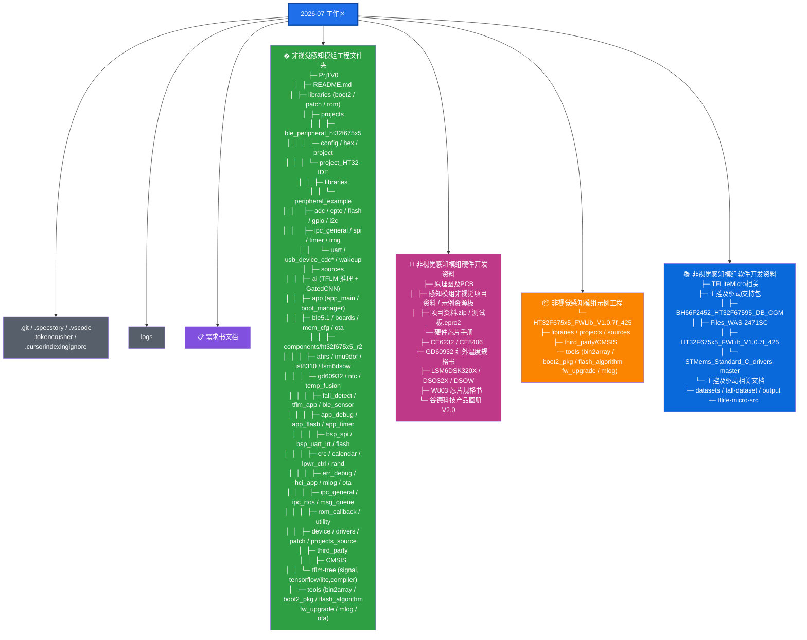

```mermaid
graph LR
    ROOT["<b>2026-07</b><br/>(工作区根目录)"]

    DOT_CURSOR[".cursorindexingignore"]
    DOT_GIT[".git"]
    DOT_SPEC[".specstory"]
    DOT_TOKEN[".tokencrusher"]
    DOT_VSCODE[".vscode"]
    LOGS["logs"]

    REQ["需求书文档"]
    REQ_HIST["文档历史版本"]
    REQ_F1["功能需求书-白楠帝.docx"]
    REQ_F2["周计划_V1.4.docx"]
    REQ_F3["视觉版甲乙职责分工表.docx"]
    REQ_H1["需求书-0601.docx"]
    REQ_H2["需求书-A型号视觉方案.docx"]
    REQ_H3["需求书-B型号无视觉方案.docx"]
    REQ_H4["需求书-V0706.docx"]

    MAIN["非视觉感知模组工程文件夹"]
    PRJ["Prj1V0"]
    PRJ_README["README.md"]
    PRJ_LIB["libraries"]
    PRJ_BOOT2["boot2"]
    PRJ_PATCH["patch"]
    PRJ_ROM["rom"]
    PRJ_PROJ["projects"]
    PRJ_P1["ble_peripheral_ht32f675x5"]
    PRJ_P1A["config"]
    PRJ_P1B["hex"]
    PRJ_P1C["project"]
    PRJ_P1D["project_HT32-IDE"]
    PRJ_PLIB["libraries"]
    PRJ_PEX["peripheral_example"]
    PRJ_EX1["adc / cpto / flash<br/>gpio / i2c / spi<br/>timer / trng / uart<br/>usb_device_cdc* / wakeup<br/>ipc_general"]
    PRJ_SRC["sources"]
    PRJ_AI["ai (TFLM + GatedCNN)"]
    PRJ_APP["app"]
    PRJ_BLE["ble5.1"]
    PRJ_BOARDS["boards"]
    PRJ_CMP["components"]
    PRJ_CMP1["ht32f675x5_r2"]
    PRJ_DEV["device"]
    PRJ_DRV["drivers"]
    PRJ_MEM["mem_cfg"]
    PRJ_OTA["ota"]
    PRJ_PATCH2["patch"]
    PRJ_PSS["projects_source"]
    PRJ_TP["third_party"]
    PRJ_TP1["CMSIS"]
    PRJ_TP2["tflm-tree"]
    PRJ_TP2A["signal"]
    PRJ_TP2B["tensorflow (lite, compiler)"]
    PRJ_TOOLS["tools"]
    PRJ_TL1["bin2array / boot2_pkg"]
    PRJ_TL2["flash_algorithm / fw_upgrade"]
    PRJ_TL3["mlog / ota"]

    HW["非视觉感知模组硬件开发资料"]
    HW_PCB["原理图及PCB"]
    HW_PCB1["感知模组非视觉项目资料"]
    HW_PCB2["示例资源板"]
    HW_PCB3["项目资料.zip"]
    HW_PCB4["测试板.epro2"]
    HW_IC["硬件芯片手册"]
    HW_IC1["CE6232 / CE8406"]
    HW_IC2["GD60932 红外温度"]
    HW_IC3["LSM6DSK320X / DSO32X / DSOW"]
    HW_IC4["W803 芯片规格书"]
    HW_IC5["谷德科技产品画册 V2.0"]

    EX["非视觉感知模组示例工程"]
    EX_FW["HT32F675x5_FWLib_V1.0.7f_425"]
    EX_LIB["libraries"]
    EX_PROJ["projects"]
    EX_SRC["sources"]
    EX_TP["third_party / CMSIS"]
    EX_TOOLS["tools"]

    SW["非视觉感知模组软件开发资料"]
    SW_TFLM["TFLiteMicro相关"]
    SW_DRV["主控及驱动支持包"]
    SW_DRV1["BH66F2452_HT32F67595_DB"]
    SW_DRV2["Files_WAS-2471SC"]
    SW_DRV3["HT32F675x5_FWLib"]
    SW_DRV4["STMems_Standard_C_drivers"]
    SW_DOC["主控及驱动相关文档"]
    SW_DOC1["datasets"]
    SW_DOC2["fall-dataset"]
    SW_DOC3["output"]
    SW_DOC4["tflite-micro-src"]

    ROOT --> DOT_CURSOR
    ROOT --> DOT_GIT
    ROOT --> DOT_SPEC
    ROOT --> DOT_TOKEN
    ROOT --> DOT_VSCODE
    ROOT --> LOGS

    ROOT --> REQ
    REQ --> REQ_HIST
    REQ --> REQ_F1
    REQ --> REQ_F2
    REQ --> REQ_F3
    REQ_HIST --> REQ_H1
    REQ_HIST --> REQ_H2
    REQ_HIST --> REQ_H3
    REQ_HIST --> REQ_H4

    ROOT --> MAIN
    MAIN --> PRJ
    PRJ --> PRJ_README
    PRJ --> PRJ_LIB
    PRJ_LIB --> PRJ_BOOT2
    PRJ_LIB --> PRJ_PATCH
    PRJ_LIB --> PRJ_ROM
    PRJ --> PRJ_PROJ
    PRJ_PROJ --> PRJ_P1
    PRJ_P1 --> PRJ_P1A
    PRJ_P1 --> PRJ_P1B
    PRJ_P1 --> PRJ_P1C
    PRJ_P1 --> PRJ_P1D
    PRJ_PROJ --> PRJ_PLIB
    PRJ_PROJ --> PRJ_PEX
    PRJ_PEX --> PRJ_EX1

    PRJ --> PRJ_SRC
    PRJ_SRC --> PRJ_AI
    PRJ_SRC --> PRJ_APP
    PRJ_SRC --> PRJ_BLE
    PRJ_SRC --> PRJ_BOARDS
    PRJ_SRC --> PRJ_CMP
    PRJ_CMP --> PRJ_CMP1
    PRJ_SRC --> PRJ_DEV
    PRJ_SRC --> PRJ_DRV
    PRJ_SRC --> PRJ_MEM
    PRJ_SRC --> PRJ_OTA
    PRJ_SRC --> PRJ_PATCH2
    PRJ_SRC --> PRJ_PSS

    PRJ --> PRJ_TP
    PRJ_TP --> PRJ_TP1
    PRJ_TP --> PRJ_TP2
    PRJ_TP2 --> PRJ_TP2A
    PRJ_TP2 --> PRJ_TP2B

    PRJ --> PRJ_TOOLS
    PRJ_TOOLS --> PRJ_TL1
    PRJ_TOOLS --> PRJ_TL2
    PRJ_TOOLS --> PRJ_TL3

    ROOT --> HW
    HW --> HW_PCB
    HW_PCB --> HW_PCB1
    HW_PCB --> HW_PCB2
    HW_PCB --> HW_PCB3
    HW_PCB --> HW_PCB4
    HW --> HW_IC
    HW_IC --> HW_IC1
    HW_IC --> HW_IC2
    HW_IC --> HW_IC3
    HW_IC --> HW_IC4
    HW_IC --> HW_IC5

    ROOT --> EX
    EX --> EX_FW
    EX_FW --> EX_LIB
    EX_FW --> EX_PROJ
    EX_FW --> EX_SRC
    EX_FW --> EX_TP
    EX_FW --> EX_TOOLS

    ROOT --> SW
    SW --> SW_TFLM
    SW --> SW_DRV
    SW_DRV --> SW_DRV1
    SW_DRV --> SW_DRV2
    SW_DRV --> SW_DRV3
    SW_DRV --> SW_DRV4
    SW --> SW_DOC
    SW_DOC --> SW_DOC1
    SW_DOC --> SW_DOC2
    SW_DOC --> SW_DOC3
    SW_DOC --> SW_DOC4

    style ROOT fill:#1f6feb,stroke:#0d47a1,color:#fff,stroke-width:2px
    style MAIN fill:#2ea043,color:#fff
    style PRJ fill:#2ea043,color:#fff
    style PRJ_AI fill:#d29922,color:#000
    style PRJ_CMP1 fill:#d29922,color:#000
    style PRJ_TP2 fill:#d29922,color:#000
    style HW fill:#bf3989,color:#fff
    style EX fill:#bf3989,color:#fff
    style SW fill:#bf3989,color:#fff
    style REQ fill:#8250df,color:#fff
```

```mermaid
graph TD
    ROOT["2026-07 工作区"]
    A[".git / .specstory / .vscode<br/>.tokencrusher / .cursorindexingignore"]
    B["logs"]
    C1["📋 需求书文档"]
    C2["� 非视觉感知模组工程文件夹<br/>├─ Prj1V0<br/>│  ├─ README.md<br/>│  ├─ libraries (boot2 / patch / rom)<br/>│  ├─ projects<br/>│  │  ├─ ble_peripheral_ht32f675x5<br/>│  │  │  ├─ config / hex / project<br/>│  │  │  └─ project_HT32-IDE<br/>│  │  ├─ libraries<br/>│  │  └─ peripheral_example<br/>│  │     ├─ adc / cpto / flash / gpio / i2c<br/>│  │     ├─ ipc_general / spi / timer / trng<br/>│  │     └─ uart / usb_device_cdc* / wakeup<br/>│  ├─ sources<br/>│  │  ├─ ai (TFLM 推理 + GatedCNN)<br/>│  │  ├─ app (app_main / boot_manager)<br/>│  │  ├─ ble5.1 / boards / mem_cfg / ota<br/>│  │  ├─ components/ht32f675x5_r2<br/>│  │  │  ├─ ahrs / imu9dof / ist8310 / lsm6dsow<br/>│  │  │  ├─ gd60932 / ntc / temp_fusion<br/>│  │  │  ├─ fall_detect / tflm_app / ble_sensor<br/>│  │  │  ├─ app_debug / app_flash / app_timer<br/>│  │  │  ├─ bsp_spi / bsp_uart_irt / flash<br/>│  │  │  ├─ crc / calendar / lpwr_ctrl / rand<br/>│  │  │  ├─ err_debug / hci_app / mlog / ota<br/>│  │  │  ├─ ipc_general / ipc_rtos / msg_queue<br/>│  │  │  ├─ rom_callback / utility<br/>│  │  ├─ device / drivers / patch / projects_source<br/>│  ├─ third_party<br/>│  │  ├─ CMSIS<br/>│  │  └─ tflm-tree (signal, tensorflow/lite,compiler)<br/>│  └─ tools (bin2array / boot2_pkg / flash_algorithm<br/>       fw_upgrade / mlog / ota)"]
    C3["💾 非视觉感知模组硬件开发资料<br/>├─ 原理图及PCB<br/>│  ├─ 感知模组非视觉项目资料 / 示例资源板<br/>│  ├─ 项目资料.zip / 测试板.epro2<br/>└─ 硬件芯片手册<br/>   ├─ CE6232 / CE8406<br/>   ├─ GD60932 红外温度规格书<br/>   ├─ LSM6DSK320X / DSO32X / DSOW<br/>   ├─ W803 芯片规格书<br/>   └─ 谷德科技产品画册 V2.0"]
    C4["📦 非视觉感知模组示例工程<br/>└─ HT32F675x5_FWLib_V1.0.7f_425<br/>   ├─ libraries / projects / sources<br/>   ├─ third_party/CMSIS<br/>   └─ tools (bin2array / boot2_pkg / flash_algorithm<br/>        fw_upgrade / mlog)"]
    C5["📚 非视觉感知模组软件开发资料<br/>├─ TFLiteMicro相关<br/>├─ 主控及驱动支持包<br/>│  ├─ BH66F2452_HT32F67595_DB_CGM<br/>│  ├─ Files_WAS-2471SC<br/>│  ├─ HT32F675x5_FWLib_V1.0.7f_425<br/>│  └─ STMems_Standard_C_drivers-master<br/>└─ 主控及驱动相关文档<br/>   ├─ datasets / fall-dataset / output<br/>   └─ tflite-micro-src"]

    ROOT --> A
    ROOT --> B
    ROOT --> C1
    ROOT --> C2
    ROOT --> C3
    ROOT --> C4
    ROOT --> C5

    style ROOT fill:#1f6feb,color:#fff,stroke:#0d47a1,stroke-width:3px
    style A fill:#57606a,color:#fff
    style B fill:#57606a,color:#fff
    style C1 fill:#8250df,color:#fff
    style C2 fill:#2ea043,color:#fff
    style C3 fill:#bf3989,color:#fff
    style C4 fill:#fb8500,color:#fff
    style C5 fill:#0969da,color:#fff
```
